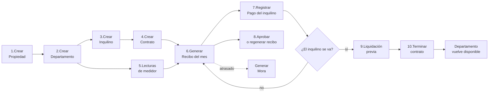
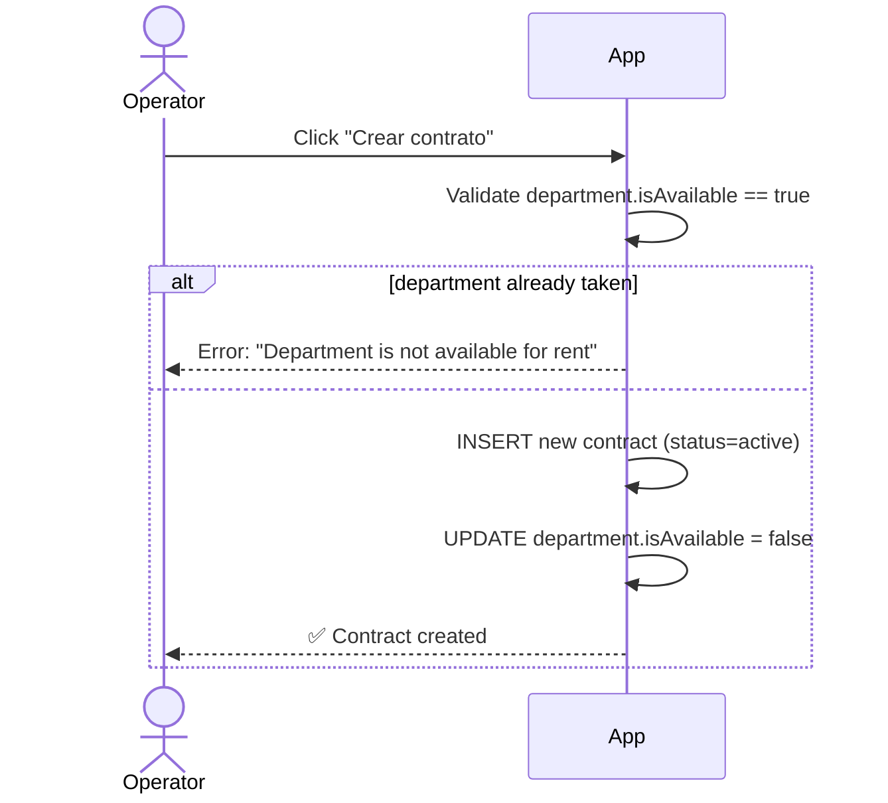
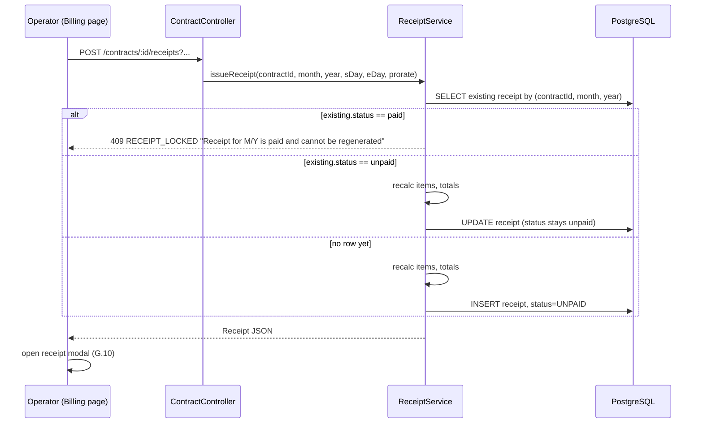
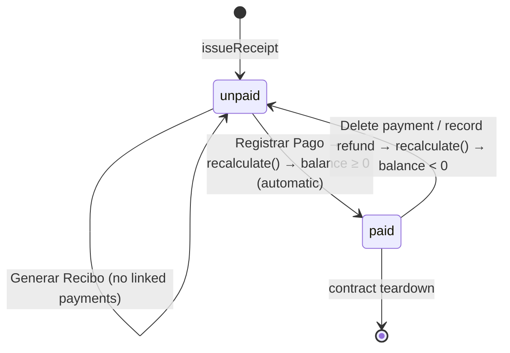
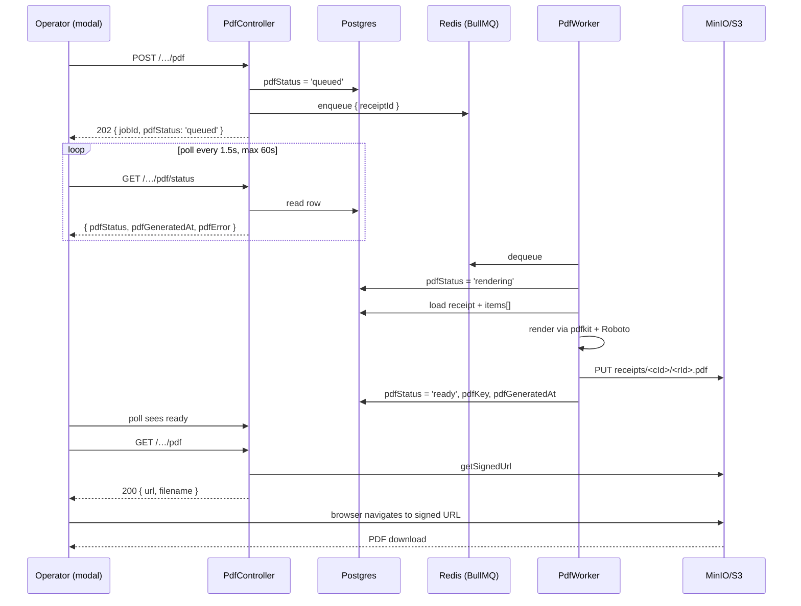

# PropManager — Operator's Guide

> This guide is for the **landlord, property administrator, or any non-technical operator** who runs PropManager day-to-day. It walks through every recurring workflow as a step-by-step recipe, names every button and menu in the Spanish UI, calls out constraints ("you can't do X if Y"), and zooms in on **receipt generation** — the heart of the system — so you can verify current behavior and capture proposed changes in the `📝 Adjustments / Notes` blocks under each step.
>
> Companion document for engineers: **`TECHNICAL_REFERENCE.md`**.

---

## Table of Contents

- [A. The Big Picture](#a-the-big-picture)
- [B. Vocabulary in 60 Seconds](#b-vocabulary-in-60-seconds)
- [C. First Login & Account Approval](#c-first-login--account-approval)
- [D. Step-by-Step: Building Out Your Inventory](#d-step-by-step-building-out-your-inventory)
   - [D.1 Create a Property (Building)](#d1-create-a-property-building)
   - [D.2 Create a Department (Apartment / Unit)](#d2-create-a-department-apartment--unit)
   - [D.3 Register a Tenant](#d3-register-a-tenant)
- [E. Step-by-Step: Starting a Rental](#e-step-by-step-starting-a-rental)
   - [E.1 Create a Contract](#e1-create-a-contract)
- [F. Step-by-Step: Utility Metering](#f-step-by-step-utility-metering)
   - [F.1 Add a Meter Reading](#f1-add-a-meter-reading)
   - [F.2 How Consumption Is Calculated](#f2-how-consumption-is-calculated)
- [G. Step-by-Step: Monthly Billing (Receipts)](#g-step-by-step-monthly-billing-receipts)
   - [G.1 Opening the Billing Page](#g1-opening-the-billing-page)
   - [G.2 The Month / Year Selector](#g2-the-month--year-selector)
   - [G.3 The Consumption Panel](#g3-the-consumption-panel)
   - [G.4 The Extra Charges Panel](#g4-the-extra-charges-panel)
   - [G.5 The "Indicar salida anticipada" Toggle](#g5-the-indicar-salida-anticipada-toggle)
   - [G.6 The "Prorratear alquiler" Checkbox](#g6-the-prorratear-alquiler-checkbox)
   - [G.7 The Mora (Late Fee) Generator](#g7-the-mora-late-fee-generator)
   - [G.8 The Preview Pane](#g8-the-preview-pane)
   - [G.9 The "Generar Recibo" Button](#g9-the-generar-recibo-button)
   - [G.10 The Receipt Modal](#g10-the-receipt-modal)
   - [G.11 The "Registrar Pago" Action](#g11-the-registrar-pago-action)
   - [G.12 Regenerating a Receipt](#g12-regenerating-a-receipt)
   - [G.13 Receipt Status Machine](#g13-receipt-status-machine)
   - [G.14 Receipt Anatomy — Field by Field](#g14-receipt-anatomy--field-by-field)
   - [G.15 Worked Example: Proration Math](#g15-worked-example-proration-math)
   - [G.16 Worked Example: Day-1 Attribution Rule](#g16-worked-example-day-1-attribution-rule)
   - [G.17 Worked Example: Late-Fee Grace Period](#g17-worked-example-late-fee-grace-period)
   - [G.18 Worked Example: Negative Consumption Fallback](#g18-worked-example-negative-consumption-fallback)
   - [G.19 Failure Scenarios & Recovery](#g19-failure-scenarios--recovery)
   - [G.20 Receipt PDF Generation](#g20-receipt-pdf-generation)
   - [G.21 Payments and the Tenant Balance](#g21-payments-and-the-tenant-balance)
- [H. Step-by-Step: Payments](#h-step-by-step-payments)
   - [H.1 Fields](#h1-fields)
   - [H.2 How a receipt-linked payment changes the receipt](#h2-how-a-receipt-linked-payment-changes-the-receipt)
   - [H.3 Editing or deleting a payment](#h3-editing-or-deleting-a-payment)
   - [H.4 Constraints](#h4-constraints)
   - [H.5 Caveat: legacy payments and the receipt items snapshot](#h5-caveat-legacy-payments-and-the-receipt-items-snapshot)
- [I. Step-by-Step: Extra Charges](#i-step-by-step-extra-charges)
   - [I.1 Manual Extra Charges](#i1-manual-extra-charges)
   - [I.2 Auto Late Fees](#i2-auto-late-fees)
- [J. Step-by-Step: Mid-Month Departures (Prorating)](#j-step-by-step-mid-month-departures-prorating)
- [K. Step-by-Step: Closing a Contract](#k-step-by-step-closing-a-contract)
   - [K.1 Settlement Preview](#k1-settlement-preview)
   - [K.2 Termination (Final Closure)](#k2-termination-final-closure)
- [L. Admin Tasks](#l-admin-tasks)
   - [L.1 Approve or Reject New Users](#l1-approve-or-reject-new-users)
- [M. Constraints Cheat Sheet — "Why Can't I…?"](#m-constraints-cheat-sheet--why-cant-i)
- [N. Frequently Asked Questions](#n-frequently-asked-questions)
- [O. Glossary](#o-glossary)

---

## How to Read the Adjustments Callouts

Every subsection in the receipt-related chapters (consumption, billing, payments, extras, prorating, termination) ends with a callout that looks like this:

> **📝 Adjustments / Notes**
>
> _TODO: capture proposed changes here._

Fill these in with what you want to change about that step. They are intentionally short prompts — write a one-line summary in the block, and capture detail in your team's ticket tracker if needed.

---

## A. The Big Picture

PropManager helps you go from "I own a building with empty apartments" to "I send a fully-priced monthly bill to each tenant and track who has paid". The end-to-end flow is:



The operator never has to manually compute anything. Once readings and payments are recorded, every receipt is calculated from real data: `monthly rent + electricity consumption × rate + water consumption × rate + extra charges − payments = balance`.

**Tip:** the most common task is generating a monthly receipt. Everything else (creating properties, departments, tenants, contracts) is one-time setup or rare events.

---

## B. Vocabulary in 60 Seconds

| Spanish UI Label | What it means | Real-world example |
| :-- | :-- | :-- |
| **Propiedad** | A whole building you manage. | "Edificio Arequipa 1234". |
| **Departamento** | One rentable unit inside a property. | "Depto 201", "Studio A". |
| **Inquilino** | A real person who rents a department. | "Juan Pérez". |
| **Contrato** | The agreement linking one inquilino to one departamento for a date range. | "Juan rents Depto 201 from 2026-01-01 to 2026-12-31 at S/ 1500/month". |
| **Adelanto** | Upfront one-month rent paid at the start. Refundable at termination. | S/ 1500. |
| **Garantía** | Security deposit. Refundable minus damages/unpaid services. | S/ 1500. |
| **Medidor** | A water or electricity meter on a department. | A single kWh counter on the wall. |
| **Lectura** | A meter reading (a value at a moment in time). | "Day 1 of May: 4520 kWh". |
| **Consumo** | How much the tenant used = current reading − previous reading. | "300 kWh this month". |
| **Recibo** | The monthly bill: rent + water + light + extras − payments = balance. | "April receipt for Depto 201". |
| **Cargo extra** | Any one-off line item: cable, cleaning, repairs. | "Limpieza: S/ 50". |
| **Pago** | Money received from the tenant. | "Tenant paid S/ 1000 on April 5". |
| **Liquidación** | Read-only forecast of "what does the tenant owe / how much do we refund" at checkout. | — |
| **Terminación** | The final, persisted closure of a contract. | — |
| **No pagado / Pagado** | Receipt status. `No pagado` is the default on creation. `Pagado` is set manually by the operator and is terminal (cannot be regenerated or reverted in this version — see [TEN-5](https://linear.app/tenant-aqp/issue/TEN-5)). | — |
| **Indicar salida anticipada** | UI toggle to declare a mid-month departure on the billing page. | — |
| **Prorratear alquiler** | Checkbox that scales the rent by `daysOccupied / daysInMonth`. | — |
| **Generar PDF / Descargar PDF** | Operator-triggered render of the receipt as a printable A4 PDF, stored in S3-compatible object storage. Auto-regenerated when the receipt is regenerated. | — |

---

## C. First Login & Account Approval

### What you need
- A web browser pointed at the PropManager URL (in development: `http://localhost:5173`).
- An email and password.

### Step-by-step

1. Open the app. You'll land on the **Iniciar sesión** screen.
2. If you already have an account → enter email + password → **Iniciar sesión**.
3. If you don't → click **Regístrate**. Fill the form (password must be **at least 8 characters**) and submit. You'll see *"Account pending approval"*.
4. **Wait.** Your account starts as `Pendiente`. An admin must approve you before you can log in. Until then, every login attempt will show *"Your account is pending admin approval"*.
5. Once approved, log in normally.

### What happens behind the scenes
- The system gives your browser a short-lived **access token** (15 min) and a **refresh token** stored as a cookie (7 days). When the short token expires, the system silently issues a new one — you stay logged in without re-entering credentials.
- If you close the tab and reopen it within 7 days, you'll be logged back in automatically.

### Constraints
| Scenario | What happens |
| :-- | :-- |
| You try to log in with the wrong password | Error: *"Invalid credentials"*. |
| Your account is still `Pendiente` | 403: *"pending admin approval"*. Wait for an admin. |
| Your account was `Rechazado` | 403: *"Your account has been rejected"*. Contact the admin. |
| Email already registered | 409: *"Email already in use"*. Recover the password offline. |
| You sign in from a second browser/device | The previous browser is **kicked out** on its next silent refresh. PropManager allows only one active session per account. |

---

## D. Step-by-Step: Building Out Your Inventory

This is what you do **once** when you start using PropManager (or each time you acquire a new building/unit).

### D.1 Create a Property (Building)

A *Propiedad* is the building you own. It owns the **electricity rate** (`S/ / kWh`) and **water rate** (`S/ / m³`) that all its units inherit.

**Where:** sidebar → **Propiedades** → click the **+** button (top of page).

**Fields:**

| Field | Required | Notes |
| :-- | :-- | :-- |
| Nombre | yes | Display name. Example: "Edificio Centro". |
| Dirección | yes | Free-text address. Example: "Av. Arequipa 1234, Lima". |
| Costo por kWh (light) | optional | Default `S/ 0.25`. Used to compute electricity charges. |
| Costo por m³ (water) | optional | Default `S/ 0.15`. Used to compute water charges. |

**Constraints:**
- The two cost fields are **per property**, not per department. Every department in the building uses the same rates.
- You can update the rates later; the change applies to **future receipts only**. Receipts already issued for prior months keep their original amounts because `items[]` was frozen when the receipt was generated.
> **📝 Adjustments / Notes**
>
> _✅ DONE: We should be able to edit the rates in a future._ — Property edit modal added on the PropertyDetail page; supports editing name, address, light rate, and water rate. Forward-only: existing receipts keep their frozen `items[]`.

### D.2 Create a Department (Apartment / Unit)

A *Departamento* is one rentable space inside a property.

**Where:** sidebar → **Departamentos** → **+**. Or from the **Propiedades** detail page click "Agregar departamento".

**Fields:**

| Field | Required | Notes |
| :-- | :-- | :-- |
| Nombre | yes | "Depto 201", "Estudio A". |
| Piso | yes | Numeric floor. |
| Número de habitaciones | yes | Numeric. |
| Propiedad | yes | The building this unit belongs to. |
| Lectura inicial de agua | optional | If you have one already, enter it now so the first receipt has a baseline. |
| Fecha lectura inicial agua | optional | The date that initial water reading was taken. |
| Lectura inicial de luz | optional | Same idea for electricity. |
| Fecha lectura inicial luz | optional | — |
| Mes/año de facturación inicial | optional | Force the initial reading into a specific billing month (used if you are seeding historical data). |

**What happens when you fill the optional readings:**
- The system **automatically creates a water meter and/or an electricity meter** for the department.
- The system **records the initial reading** with the date you provided.
- From now on, every new reading you add for that meter computes consumption against the previous reading.

**Constraints:**
- You can create a department **without** initial readings, but then your first receipt will show no electricity/water charges until you have **two readings** (the system needs two to compute consumption).
- A new department starts as **`isAvailable = true`** ("disponible"). You can immediately attach a contract to it.
- A department can have at most **one water meter and one electricity meter**.

> **📝 Adjustments / Notes**
>
> _✅ DONE: The initial readings should be required, not optional._ — DTO `CreateDepartmentDto` now requires `initialWaterReading`, `initialWaterReadingDate`, `initialElectricityReading`, `initialElectricityReadingDate` (numbers must be ≥ 0). Both frontend forms (`Departments.tsx`, `PropertyDetail.tsx`) mark these inputs as `required`. Service unconditionally creates both meters + initial readings.
>
> _✅ DONE: By default, the dates for initial readings should be the same, but they can be adjusted._ — Both forms now show **two** separate date pickers (water + light), each defaulting to today. The operator can adjust them independently.

### D.3 Register a Tenant

An *Inquilino* is the actual person renting. They are **not** a system user — they don't log in.

**Where:** sidebar → **Inquilinos** → **+**.

**Fields:**

| Field | Required | Notes |
| :-- | :-- | :-- |
| Nombre | yes | Full name. |
| Email | yes | Must be unique across all tenants. |
| Teléfono | optional | Used for contact (future WhatsApp integration). |
| Documento de identidad | optional | DNI / passport number. |

**Constraints:**
- Email is **unique** at the database level. Trying to create a second tenant with the same email will fail.
- Tenants can hold contracts across multiple properties — they are not tied to a single building.
- Deleting a tenant with active contracts is **blocked**: you must terminate or remove the contracts first.

> **📝 Adjustments / Notes**
>
> _✅ DONE: The email should be optional, not required._ — `Tenant.email` is now `nullable: true` (still `unique` for non-null values; multiple NULLs allowed). DTO marks email `@IsOptional()`. Frontend forms (`Tenants.tsx`, `PropertyDetail.tsx`, `TenantDashboard.tsx`, `DepartmentDashboard.tsx`) updated to label email as "(Opcional)" and skip rendering when null.
>
> _✅ DONE: The phone number should be mandatory, not optional._ — `Tenant.phone` is now non-nullable; DTO requires it (`@IsNotEmpty()`). Frontend forms mark the input `required`.
>
> _✅ DONE: The Document of Identity should be mandatory, not optional. Also it should be unique across all tenants._ — `Tenant.documentId` is now `unique: true`, non-nullable; DTO requires it. Both creation forms include a required "Documento de Identidad" field. Duplicate-DNI rejection bubbles up with a clear toast message.

---

## E. Step-by-Step: Starting a Rental

### E.1 Create a Contract

The *Contrato* binds one tenant to one department for a date range and captures the financial terms.

**Where:** sidebar → **Contratos** → **+**. Or from the inquilino's or departamento's detail page.

**Fields:**

| Field | Required | Notes |
| :-- | :-- | :-- |
| Inquilino | yes | Pick from the list. |
| Departamento | yes | **Only available departments appear in the dropdown.** |
| Fecha de inicio | yes | Contract start. |
| Fecha de fin | yes | Contract end. |
| Renta mensual | yes | Monthly rent in S/. |
| Adelanto | yes | Upfront month of rent. Refundable at termination. |
| Garantía | yes | Security deposit. Refundable minus deductions. |

**What happens behind the scenes when you click Save:**



**Constraints:**

| Scenario | What happens |
| :-- | :-- |
| The department is already rented (has an active contract) | Blocked: *"Department X is not available for rent"*. |
| You forget to pick a tenant or department | Validation error before submit. |
| Two contracts on overlapping dates for the same unit | Blocked by the `isAvailable` check, **but** PropManager does not check date overlaps directly. If you somehow free the unit and re-rent it, dates can in principle overlap. Keep this in mind for record-keeping. |
| You delete a contract | The department flips back to **`isAvailable = true`** automatically. |

---

## F. Step-by-Step: Utility Metering

This is the recurring task that drives accurate billing.

### F.1 Add a Meter Reading

**Where:** sidebar → **Lecturas** → **+**. Or from the department's dashboard.

**Fields:**

| Field | Required | Notes |
| :-- | :-- | :-- |
| Medidor | yes | Pick the specific meter (water or light on a specific department). |
| Valor de lectura | yes | The number on the physical meter today. |
| Fecha de lectura | yes | When you read it. Stored as a `date` (no time component). |
| Mes / año de facturación | optional | Override the billing period this reading counts toward. Leave blank to auto-derive. |

**How the system attributes a reading to a billing period (auto-derive rule):**

- If the reading date is **day 1 of a month**, it counts toward the **previous month**. Rationale: a reading taken on May 1 captures all consumption that happened during April.
- For any other day, it counts toward the **current month** of the reading date.

You can override this in the form by setting "Mes/año de facturación" explicitly.

> **📝 Adjustments / Notes**
>
> _✅ DONE: When the reading date is more than 1 day after the first of the month, it should count toward the current month._ — Confirmed already implemented in `deriveBillingPeriod()` (`meter-reading.service.ts:131-139` and `department.service.ts`). Day 1 → previous month; day 2-31 → current month. No code change.
> 
> _✅ DONE: This scenario only will happens when the tenant leaves at mid of the month._ — Same logic; mid-month-departure readings naturally fall under the "day 2-31 → current month" branch.

### F.2 How Consumption Is Calculated

When the system generates a receipt for, say, April 2026:

1. It finds the **latest reading** whose billing period is `April 2026` → this is `currentReading`.
2. It finds the **latest reading** whose billing period is strictly before April 2026 → this is `previousReading`.
3. `consumption = currentReading − previousReading`.
4. `cost = consumption × propiedad.costoPorUnidad`.

**Worked example:**

| Date entered | Reading | Billing period (auto) |
| :-- | :-- | :-- |
| 2026-04-01 | 4520 kWh | March 2026 |
| 2026-05-01 | 4820 kWh | April 2026 |

April 2026 receipt: `consumption = 4820 − 4520 = 300 kWh`, `cost = 300 × 0.25 = S/ 75.00`.

**Period mode (used when you set Day-of-departure):** instead of using the `billingMonth/billingYear` fields, the system uses the **date range** `[day startDay … day endDay] of (month, year)`:
- `currentReading` = newest reading with `date <= endDay`.
- `previousReading` = newest reading with `date < startDay`.

This is how a partial-month receipt gets honest consumption math.

**Constraints & common pitfalls:**

| Scenario | What happens |
| :-- | :-- |
| Only one reading exists for the meter | The April receipt will show **no electricity charge** (no baseline to subtract from). |
| You record two readings with the **same billing period** (e.g. two readings both flagged April) | The system uses **only the most recent by date**; the earlier reading is ignored. |
| The new reading is **lower** than the previous (broken meter, replaced unit) | The system treats `consumption = 0` and silently logs a warning. **Manually verify** the receipt — your tenant won't be charged anything that month. See [G.18](#g18-worked-example-negative-consumption-fallback). |
| You enter the reading on day 1 expecting it to bill that month | It will bill the **previous** month instead. Use the explicit "mes/año" override if you don't want that behavior. |
| You forgot to take a reading this month | Take a reading next month covering both months' usage. The receipt will charge the cumulative consumption for the period when you record it. |

> **📝 Adjustments / Notes**
>
> _TODO: capture proposed changes here._

---

## G. Step-by-Step: Monthly Billing (Receipts)

This chapter is the most detailed in the guide because billing is where the most adjustments are needed. Each subsection covers a single UI control or one piece of receipt logic, in the order you encounter them on the billing page.

### G.1 Opening the Billing Page

**Where:** sidebar → **Departamentos** → click a department → **Facturación** tab. URL: `/departments/:id/billing`.

The page header reads `Facturacion — {departmentName}` with the property name underneath. If the contract on this department has already been terminated, you'll see a red banner:

> **Contrato terminado. No se pueden generar nuevos recibos.**

The Generar Recibo button is still rendered but operations on a terminated contract are not the intended use case.

**What the page loads on entry (5 requests in parallel + 1 sequential):**

| # | Request | Purpose |
| :-- | :-- | :-- |
| 1 | `GET /departments/:id` | Department metadata for the header. |
| 2 | `GET /contracts?departmentId=:id` | Active contract on this department. |
| 3 | `GET /departments/:id/consumption/period?month&year` | Period-scoped electricity + water consumption (used as fallback if no receipt exists). |
| 4 | `GET /extra-charges?contractId&month&year` | Extra charges for the selected period. |
| 5 | `GET /contracts/:id/termination` | If terminated, the snapshot. |
| 6 | `GET /contracts/:id/receipts?month&year` | Receipt preview — returns the persisted receipt if it exists, otherwise an on-the-fly computation. |

If any request fails, you'll see the toast *"No se pudieron cargar los datos de facturacion"*.

> **📝 Adjustments / Notes**
>
> _TODO: capture proposed changes here._

### G.2 The Month / Year Selector

Two controls at the top of the page:

- **Mes** dropdown (Enero through Diciembre).
- **Año** numeric input.

Changing either:
- **Clears** the `receipt` and `previewReceipt` state.
- If a termination already exists, the page leaves the "Salida" panel open; otherwise the departure inputs (`departureDay`, `prorateRent`) are cleared.
- Re-fires all 6 requests from G.1.

**Constraint:** the dropdown is **1-indexed for the API** (Enero = 1, Febrero = 2 …), even though JavaScript natively uses 0-indexed months. The frontend stores `month = i + 1` where `i` is the dropdown index.

> **📝 Adjustments / Notes**
>
> _TODO: capture proposed changes here._

### G.3 The Consumption Panel

This panel displays the **electricity** and **water** consumption + cost for the selected period.

There are two sources for these numbers and the panel prefers whichever is available:

1. **If a receipt already exists** (`receipt.id` is set), use the cost from the receipt's `items[]` array. Look up the line whose description contains `electricity / luz` and the one containing `water / agua`. The number of units is **not** stored on the receipt entity directly — only the cost — so the units column is shown as `null` when reading from a persisted receipt.
2. **If no receipt yet exists**, fall back to the `GET /departments/:id/consumption/period` response, which returns `{ consumption: number, cost: number }` for both meter types.

| Field shown | When receipt exists | When only preview exists |
| :-- | :-- | :-- |
| Light cost | Extracted from `items[].amount` matching `"electricity"` / `"luz"` | `consumption.light.cost` from the API |
| Light has readings | `lightCost > 0` | `consumption.light.consumption > 0` |
| Water cost | Same logic for `"water"` / `"agua"` | `consumption.water.cost` |
| Units displayed | `null` (not visible) | `consumption.light.consumption` |

**Constraint:** if a property's per-unit rate changes after a receipt is issued, the panel will still show the **old** cost for that month (because it reads from the persisted `items[]`). Future months will use the new rate.

> **📝 Adjustments / Notes**
>
> _✅ DONE: The receipt should be able to recalculate using the last reading meter for the month._ — Flipped the display precedence: the consumption panel (and resulting `total`) now always prefers live values from `GET /departments/:id/consumption/period` (latest readings × latest property rates) over the frozen `items[]` of any persisted receipt. The persisted receipt's frozen amounts remain visible in the receipt modal (G.10) for audit. To commit the updated figures to the receipt itself, click **Regenerar Recibo** (which already pulls fresh consumption + extras and rebuilds `items[]`).
>
> Example:
>   - The current billed period for electricity is `S/ 10` and `S/ 20` for water
>   - The month rent is `S/ 1500.00`.
>   - So the complete billing for that period will be `S/ 1530.00`
>
> But, if for some reason the price for the services change or if we add a new service charge, the pricing screen should be able to show the new billing using the latest values from the API.

### G.4 The Extra Charges Panel

Lists every `ExtraCharge` row whose `(contractId, month, year)` matches the selected period.

For each row the panel shows:
- Description (`Limpieza`, `Cable TV`, `Mora por recibo atrasado (N dias x S/ R/dia)`).
- Amount.
- A **delete** button — except for late-fee rows, whose delete is disabled (a 400 is returned by the API if you try).

Below the list there is an inline form to **add** a new manual extra charge:

| Field | Notes |
| :-- | :-- |
| Descripción | Free-text. |
| Monto | Amount in S/. |
| (Hidden) Mes, Año, Contrato | Taken from the page context. |

Clicking **+ Agregar** submits `POST /extra-charges`, then refetches the extra charges list AND the receipt preview, so the new charge immediately surfaces in the preview totals.

**Constraint:** the extras list, the preview, and the persisted receipt can fall out of sync if the receipt was **approved** before the extra was added. You'll see the extra row, you'll see it in the preview totals, but the **persisted approved receipt's** `items[]` will not include it until you **Regenerar** (see G.12).

> **📝 Adjustments / Notes**
>
> _TODO: capture proposed changes here._

### G.5 The "Indicar salida anticipada" Toggle

A text button that reveals the mid-month departure controls. Visible only when there's an active contract and the contract is not already terminated.

Clicking it:
- Sets `showDeparture = true`.
- Pre-fills `actualDepartureDate` with the contract's original `endDate` (date portion only, in `YYYY-MM-DD`).
- Reveals the inputs described in G.6 and the "Cerrar contrato" form.

If a termination already exists in the database for this contract, the page **auto-opens** this panel on load and shows a read-only "Contrato cerrado" badge with the persisted figures (no editing possible).

> **📝 Adjustments / Notes**
>
> _TODO: capture proposed changes here._
>
> _✅ DONE: The "Dia de salida" value should be come from the last reading date was taken_. — New endpoint `GET /departments/:id/meter-readings/latest` returns `{ date }` (max across both meters). When the operator clicks "Indicar salida anticipada", if the latest reading falls within the selected billing month/year, `departureDay` is pre-filled with the day-of-month and `prorateRent` is set to `true`. If the reading is in a different period (or no readings exist), the field stays blank.

### G.6 The "Prorratear alquiler" Checkbox

Inside the departure panel:

- **Día de salida** — a number input (1-31). Stored as `departureDay` (string).
- **Prorratear alquiler** — checkbox that only renders **after** you've typed a departure day. Stored as `prorateRent` (boolean).
- **Cancelar** — clears departureDay, prorateRent, actualDepartureDate, apartmentCondition, guaranteeDeduction.

The combination of these inputs changes how the receipt is generated:

| `prorateRent` | `departureDay` | Effect on receipt |
| :-- | :-- | :-- |
| false (or no checkbox) | empty | Full month rent. Consumption uses the **billing-period mode** (`billingMonth/billingYear` matching). |
| false | filled (e.g. `15`) | Full month rent. Consumption uses **period mode** (`startDay=1, endDay=15`) — utilities are scoped to those days. |
| true | filled | Rent is prorated `(daysOccupied / daysInMonth) × rentAmount`. Consumption uses period mode. |
| true | empty | Has no effect — the checkbox is hidden until `departureDay` is filled. |

The mid-month math is detailed in [G.15](#g15-worked-example-proration-math).

> **📝 Adjustments / Notes**
>
> _TODO: Capture proposed changes here._
>
> _✅ DONE: The "Día de salida" value should come from the last reading date taken._ — Duplicate of G.5 TODO. See implementation note in G.5.
>
> _✅ DONE: The "Prorratear alquiler" option should be enabled by default._ — Superseded: the checkbox was removed entirely. Per current policy, when a `Día de salida` is set the rent is **always** prorated (daysOccupied / daysInMonth × full rent). A short inline hint reads "Alquiler se cobra solo por días ocupados." Both the preview fetch and Generar Recibo always pass `prorateRent=true` when a departure day is present.
>
> _✅ DONE: The UI for this feature should include three key sections:_ — Salida card now uses a 2-column grid (left = `Cierre de contrato` form, right = three stacked panels):
>
> - **Créditos disponibles** (emerald) — advance + (guarantee − deduction). Sums to `Total créditos`. Period payments and prorated-rent refunds are **not** credits in this model: the tenant never pays the last month separately (advance covers it), and rent for days stayed is charged on the bill side rather than refunded on the credit side.
> - **Total facturado del mes** (red) — prorated rent (always prorated when a departure day is set) + light + water + manual extras/repairs + mora. Sums to `Total facturado`.
> - **Resumen** — shows `+ Créditos`, `− Facturado`, then either `A devolver al inquilino`, `Saldo a cobrar al inquilino`, or `Balance` depending on sign.
>
> Panels render only while `!termination` (the snapshot view replaces them after closure).
>
> _✅ DONE: The "Agregar cargo extra" section should be renamed to "Agregar cargo extra o reparación". This is just a suggestion, so choose the best option for the UI. This change should only apply when "Indicar salida anticipada" is enabled. The section should also include additional charges and repair costs for any property damage._ — Heading switches to "Agregar Cargo Extra o Reparación" while `showDeparture` is true; description placeholder also widens to suggest repair examples ("Reparación de lavabo, Pintura, etc."). Backend unchanged — repairs are free-text extra-charge rows under the same `ExtraCharge` entity.
>
> _✅ DONE: Make sure to provide a clear UI/UX that shows how the credits are being applied to cover all charges._ — The `Resumen` panel displays the math explicitly: `+ Créditos`, `− Facturado`, then the net result labeled either `A devolver al inquilino` (positive, emerald) or `Saldo a cobrar al inquilino` (negative, red). Per-line breakdowns in the Créditos and Facturado panels show which components are being applied (advance, guarantee, payments, prorated refund vs. rent, services, extras, mora).

### G.7 The Mora (Late Fee) Generator — REMOVED

The auto mora generator was removed in Phase 05. The previous rule (day-15 calendar gate × `ratePerDay`) was never validated against business policy and was tangled with the deprecated `pending_review` / `approved` status machine.

Reintroduction (with stakeholder-confirmed rules) is tracked in [TEN-6](https://linear.app/tenant-aqp/issue/TEN-6).

Historical `late_fee` extra-charge rows continue to display correctly on the billing page; only the generator UI and backend endpoint are gone.

> **📝 Adjustments / Notes**
>
> _✅ DONE: Mora generator removed in Phase 05 (see TEN-6 for future reintroduction)._

### G.8 The Preview Pane

This is the running tally you see while you tweak inputs. It shows:

| Line | Source |
| :-- | :-- |
| Renta mensual (or `Renta (X/Y dias)` if prorated) | `rentAmount` (full or prorated) |
| Consumo de luz | `lightCost` from G.3 |
| Consumo de agua | `waterCost` from G.3 |
| Cargos extras | `extraTotal = sum(extraCharges.amount)` |
| **Total** | `rentAmount + lightCost + waterCost + extraTotal` |

The preview is **deterministic from current page state** — it does **not** call the API. It is purely a UI computation so the operator sees the impact of toggles immediately. The actual receipt body is produced by the backend when you click Generar Recibo (G.9).

**Important nuance:** the preview's "Total" is the `totalDue` only. It does **not** subtract payments. The persisted receipt does include payments as negative line items and computes `balance = totalPayments − totalDue`. Always check the receipt modal (G.10) for the final balance, not the inline preview.

> **📝 Adjustments / Notes**
>
> _TODO: capture proposed changes here._

### G.9 The "Generar Recibo" Button

The main call to action.

**What it sends:**

```
POST /contracts/{contractId}/receipts?month={M}&year={Y}
   [&startDay=1&endDay={departureDay}&prorateRent=true]
```

- `startDay` is hardcoded to `1` on the frontend; only `endDay` and `prorateRent` come from the operator.
- There is no `force` flag any more. Regeneration is allowed for any `unpaid` receipt; clicking on a `paid` row is server-side rejected with `409 RECEIPT_LOCKED` (and the button is disabled in the UI before that point).

**What the backend does:**



**Result:** the receipt is persisted with status **`unpaid`** (new) or stays **`unpaid`** (regen of existing unpaid row).

**Toast on success:** *"Recibo generado exitosamente"*.

**Failure modes:**
- Targeting a paid period → 409 `RECEIPT_LOCKED`. The UI hides the button before that point, so this is defense-in-depth.
- Network error → toast: *"Error al generar recibo (details)"*.
- Race condition (two operators clicking at once) → the second click upserts the same row; the unique constraint `(contractId, month, year)` keeps things consistent.

> **📝 Adjustments / Notes**
>
> _✅ DONE: Phase 05 — dropped the `force` flag; paid receipts are now terminal._

### G.10 The Receipt Modal

Right after a successful Generar Recibo (or when the operator opens an existing receipt), a modal slides in showing the full receipt: tenant name, department name, property address, period, every line item with amount, totals, balance, and a status pill.

The status pill colors:

| Status | Pill text | Color |
| :-- | :-- | :-- |
| `unpaid` | No pagado | amber |
| `paid` | Pagado | emerald |

**Saldo Anterior (Carry-forward):** If the tenant has unpaid balances from previous months, the modal will display a **Saldo anterior (Deuda pendiente)** section. This lists each unpaid month and its remaining balance. These amounts are **not** added to the current month's `Total mes actual`, but are summed into a final **TOTAL DEUDA** line, giving the tenant a clear view of their entire debt.

When the receipt is `paid`, a sub-line beneath the pill shows `Pagado el <fecha> por <user-id-short>` (provenance from the `paidAt` / `paidBy` columns).

The modal includes action buttons depending on status (see G.11) and a "Enviar por WhatsApp" placeholder button that currently shows an alert ("WhatsApp sending will be implemented in next phase") — it does not send anything.

> **📝 Adjustments / Notes**
>
> _✅ DONE: Phase 05 collapsed the 3-state pill to 2 states; added paid-provenance line._

### G.11 The "Registrar Pago" Action

One button appears in the receipt modal while status is `unpaid`:

| Button | API call | What it sets |
| :-- | :-- | :-- |
| **Registrar Pago** | `POST /payments` with `contractId`, `receiptId`, `amount`, `date`, `method`, optional `reference` and `description`. | Creates a payment row; the system runs `ContractLedgerService.recalculate()` which applies payments to receipts in FIFO order (oldest first). The receipt may flip to `paid` automatically if the cumulative payments cover `totalDue`. |

There is **no** "Marcar como pagado" button. To mark a receipt as paid, record a payment of the right amount (or greater, if you want to leave credit for future receipts).

The Registrar Pago modal pre-fills:
- `Contrato` and `Recibo` (from the open receipt — operator cannot change them).
- `Monto` = the receipt's outstanding amount from the ledger (`remaining` field — FIFO-aware).
- `Fecha` = today.
- `Método` = cash (operator changes if needed).
- **Saldo del contrato** = a banner near the amount input showing the contract's overall balance and any remaining credit.

After save, the receipt modal refetches both the payment list (new "Pagos registrados" section under the items), the receipt itself, and the ledger snapshot (so the new status / balance / credit show immediately).

**`paid` is no longer terminal.** A `paid` receipt reverts to `unpaid` automatically if its linked payments are deleted or a refund drops the cumulative payments below `totalDue` — see G.13. Reverting happens only as a side effect of payment-ledger changes via `recalculate()`.

> **📝 Adjustments / Notes**
>
> _✅ DONE: Phase 05 — replaced Aprobar/Denegar with single-button Marcar como pagado; flip is audited via paidAt + paidBy._
> _✅ Phase 06 — removed "Marcar como pagado" entirely. Receipt status is now derived from the payment ledger via `ContractLedgerService.recalculate()`. To mark a receipt as paid, record a payment. Payment amount pre-fill now uses the ledger snapshot's `remaining` field (FIFO-aware). Contract balance (`ledger.balance`) displayed near the amount input._

### G.12 Regenerating a Receipt

"Regenerating" means asking the backend to recompute from current data and overwrite the existing receipt row.

When you click Generar Recibo and a receipt already exists for the period:

| Existing status | Linked payments | Result |
| :-- | :-- | :-- |
| `unpaid` | none | Upserts. Status stays `unpaid`. Idempotent — click as many times as you want; the receipt picks up the latest readings, extras, and date-based payments. **Also refreshes the `carryForwardDetails` snapshot** to reflect any payments made against *previous* months since the last generation. |
| `unpaid` | one or more | **409 `RECEIPT_HAS_PAYMENTS`**: *"Receipt for M/Y has N linked payment(s); delete them before regenerating."* You must delete the payments (from the Pagos page) before regenerating, then re-record them after. |
| `paid` | any | **409 `RECEIPT_LOCKED`**: *"Receipt for M/Y is paid and cannot be regenerated."* The UI also disables the Regenerar Recibo button with hover tooltip *"Recibo pagado — no se puede regenerar"*. |

Why the `RECEIPT_HAS_PAYMENTS` block: regenerating overwrites the receipt's `items[]` snapshot and recomputes `totalDue` from current readings/extras. If payments are already linked, their amounts are still summed into `totalPayments`, but the new `totalDue` may no longer match the world the operator was paying against — silently breaking the receipt/payment alignment. The block forces the operator to consciously decide.

There is no `force` flag. There is no Denegar → Regenerar workaround.

> **📝 Adjustments / Notes**
>
> _✅ DONE: Phase 05 — dropped the `force` flag and the Denegar → Regenerar dance._
> _✅ Payment system phase — added RECEIPT_HAS_PAYMENTS guard._

### G.13 Receipt Status Machine



Key rules:
- A receipt is **always created** with status `unpaid`.
- `unpaid → unpaid` regeneration is allowed only when no payment is linked to the receipt (otherwise `409 RECEIPT_HAS_PAYMENTS`).
- `unpaid → paid` happens **only via the payment ledger**: operator records a payment via Registrar Pago; `recalculate()` applies payments in FIFO order (oldest month first) and flips status to `paid` when cumulative applied credit ≥ `totalDue`. Writes `paidAt = now`, `paidBy = actor user ID` (only if not already set).
- `paid → unpaid` happens automatically when a payment is deleted (or a refund is recorded) that drops the FIFO-applied credit below `totalDue`. `paidAt` and `paidBy` are cleared.
- There is **no manual "Marcar como pagado"** button or endpoint. To mark a receipt as paid, record a payment of the right amount.
- A `paid` receipt cannot be regenerated. To change billing data on a paid receipt, you must first delete all its linked payments (which reverts it to `unpaid` via `recalculate()`), regenerate, and re-record.
- The unique constraint `(contractId, month, year)` ensures one row per period.

> **📝 Adjustments / Notes**
>
> _✅ DONE: Phase 05 — 3-state machine collapsed to 2 states with paid as terminal._
> _✅ Payment system phase — `paid` is no longer terminal: payment delete or refund can revert to `unpaid`. Added automatic flip via Registrar Pago. See [TEN-5](https://linear.app/tenant-aqp/issue/TEN-5)._
> _✅ Phase 06 — removed "Marcar como pagado" manual flip. Status is now entirely derived from the payment ledger via `ContractLedgerService.recalculate()`. See [TEN-22](https://linear.app/tenant-aqp/issue/TEN-22)._

### G.14 Receipt Anatomy — Field by Field

When you fetch `GET /contracts/:id/receipts?month&year` you receive an object with these fields. Every field is shown in the UI somewhere; every field affects displayed totals or the receipt's status flow.

| Field | Type | Source | Meaning / how it's shown |
| :-- | :-- | :-- | :-- |
| `id` | UUID (or absent) | Persisted only. If absent, this is an on-the-fly preview, not stored yet. | Determines whether the page treats this as a "preview" vs. a real receipt. |
| `contractId` | UUID | Path parameter | Which contract this receipt belongs to. |
| `month` | int 1-12 | Query param | Billing month. |
| `year` | int | Query param | Billing year. |
| `startDay` | int or null | Query param, persisted | First day of the partial period if a prorated receipt; otherwise null. |
| `endDay` | int or null | Query param, persisted | Last day of the partial period; otherwise null. |
| `status` | enum | Persisted; default `unpaid`; derived by `ContractLedgerService.recalculate()` from the FIFO payment ledger | One of `unpaid`, `paid`. Flipped automatically by `recalculate()` when cumulative payments cover `totalDue` (→ paid) or drop below it (→ unpaid). There is no manual status-flip endpoint. |
| `paidAt` | timestamptz or null | Set by `recalculate()` when status flips to `paid`. Cleared when status reverts to `unpaid`. | Audit column. |
| `paidBy` | uuid or null | Set by `recalculate()` when status flips to `paid` — value is the `actorUserId` passed to `recalculate()` (the operator who recorded the payment). Cleared when status reverts. | Audit column. |
| `totalPayments` | decimal(10,2) | At first issuance: sum of date-matching payments. After any linked-payment mutation: `SUM(payment.amount WHERE receipt_id = X)`. Refunds (negative amounts) reduce it. | Used to compute balance. |
| `tenantName` | string | Snapshotted from `contract.tenant.name` at issue time | Frozen — does **not** update if you later rename the tenant. |
| `departmentName` | string | Snapshotted from `contract.department.name` | Frozen. |
| `propertyAddress` | string | Snapshotted from `contract.department.property.address` | Frozen. |
| `period` | string | Built at issue time | `"April 2026"` (full month) or `"1–15 April 2026"` (prorated). |
| `items[]` | jsonb array of `{description, amount}` | Built at issue time | Every line on the receipt, in order: rent, electricity, water, manual extras (each prefixed `Otros:`), late-fee extras (also `Otros:`), then payments (with **negative** amounts). |
| `carryForwardDetails` | jsonb array of `{period, balance}` | Snapshotted at issue time | A list of unpaid debts from months *prior* to the receipt month. Used to render the "Saldo anterior" section. |
| `totalDue` | decimal(10,2) | `rent + light + water + sum(extras)` | The amount the tenant is being billed **for the current month**. Does not include carry-forward. |
| `balance` | decimal(10,2) | `totalPayments − totalDue` | **Positive** = tenant has credit / overpaid. **Negative** = tenant owes. |
| `createdAt` / `updatedAt` | timestamp | Auto | TypeORM timestamps. |

**Worked example of `items[]`:**

```text
[
  { "description": "Monthly Rent (15/30 days)",          "amount":  750.00 },
  { "description": "Electricity Consumption (42 units)", "amount":   10.50 },
  { "description": "Water Consumption (8 units)",        "amount":    1.20 },
  { "description": "Otros: Limpieza",                    "amount":   30.00 },
  { "description": "Otros: Mora por recibo atrasado (5 dias x S/ 5.00/dia)", "amount":   25.00 },
  { "description": "Payment (rent) - Mar 28 transfer",   "amount": -300.00 }
]
```

`totalDue = 750 + 10.50 + 1.20 + 30 + 25 = 816.70`
`totalPayments = 300`
`balance = 300 − 816.70 = −516.70` → tenant owes S/ 516.70.

> **📝 Adjustments / Notes**
>
> _TODO: capture proposed changes here._

### G.15 Worked Example: Proration Math

**Setup:** monthly rent S/ 1500, contract covers April 2026 in full but tenant leaves on April 15.

When you toggle Salida, set Día de salida = 15, and check Prorratear alquiler:

| Step | Computation | Value |
| :-- | :-- | :-- |
| effectiveStartDay | `startDay ?? 1` | `1` |
| daysInMonth | `new Date(2026, 4, 0).getDate()` (note: month=4 in JS gives "last day of April") | `30` |
| daysOccupied | `endDay − effectiveStartDay + 1 = 15 − 1 + 1` | `15` |
| ratio | `daysOccupied / daysInMonth` | `0.5` |
| `rentAmount` | `ratio × 1500` | `750.00` |
| Description | template | `"Monthly Rent (15/30 days)"` |

**Consumption in period mode:**

| Reading | Date | Used? |
| :-- | :-- | :-- |
| 4500 kWh | 2026-03-30 | Used as `previousReading` (`date < 2026-04-01`). |
| 4520 kWh | 2026-04-01 | Skipped — its date is in the range start. The query uses **strictly less than** `rangeStart`, so the day-1 reading is **not** `previousReading`. |
| 4820 kWh | 2026-04-15 | Used as `currentReading` (newest with `date <= 2026-04-15`). |

`consumption = 4820 − 4500 = 320 kWh`. (Note this is subtly different from billing-period mode and is worth verifying for your use case.)

> **📝 Adjustments / Notes**
>
> _TODO: capture proposed changes here._

### G.16 Worked Example: Day-1 Attribution Rule

**Setup:** you record a single reading on **May 1, 2026 at 12:00 local time**, value 5200 kWh, with no explicit `billingMonth`/`billingYear`.

The system runs `deriveBillingPeriod(2026-05-01)`:

| Date condition | Branch | `billingMonth` | `billingYear` |
| :-- | :-- | :-- | :-- |
| `date.getDate() === 1` and `month === 0` (January) | previous year December | 12 | year − 1 |
| `date.getDate() === 1` and `month > 0` | previous month, same year | `month` (which is 0-indexed JS month, so for May 1 → 4 → "April") | year |
| any other day | current month | `month + 1` | year |

For May 1, 2026: branch 2 → `billingMonth = 4 (April)`, `billingYear = 2026`.

The April 2026 receipt will see this as the `currentReading` for April.

**Gotcha:** if the operator wants this reading to bill **May** instead of **April**, they must explicitly set "Mes/año de facturación = 5 / 2026" in the form.

> **📝 Adjustments / Notes**
>
> _TODO: capture proposed changes here._

### G.17 Worked Example: Late-Fee Grace Period

**Setup:** receipt for **March 2026** has `balance = −500` (tenant owes S/ 500). Operator clicks Generar Mora on **April 25, 2026** at 10:00 with `ratePerDay = 5.00`.

| Step | Computation | Value |
| :-- | :-- | :-- |
| Receipt found | `(contractId, month=3, year=2026)` | exists |
| Balance check | `balance >= 0`? | `false` (it's negative — OK to proceed). |
| Deadline | `new Date(2026, 3, 15)` ← **month=3 in JS is April** | April 15, 2026 |
| Today | `new Date()` normalized to midnight | April 25, 2026 |
| Past deadline? | `today > deadline` | `true` |
| Days overdue | `floor((today − deadline) / 86400000)` | `10` |
| Amount | `5.00 × 10` | `50.00` |
| Existing late fee? | search by `sourceReceiptId = receipt.id, type = LATE_FEE` | absent |
| Action | INSERT new `ExtraCharge` with `month=3, year=2026, type=LATE_FEE, amount=50.00, sourceReceiptId=receipt.id, ratePerDay=5.00, daysOverdue=10, description="Mora por recibo atrasado (10 dias x S/ 5.00/dia)"` | — |

**Re-running Generar Mora later:**
- On April 30 (5 more days passed) it now finds the existing row and **updates** it to `daysOverdue=15, amount=75.00`. Description updated to `"Mora por recibo atrasado (15 dias x S/ 5.00/dia)"`.

**Important caveats:**
- The deadline math `new Date(year, month, 15)` mixes 1-indexed `month` from the receipt with 0-indexed JS `Date.month`. The off-by-one is **intentional** here: a receipt for month=3 (March) ends up checking April 15 — i.e. **day 15 of the month AFTER the billing month**.
- The late fee is itself a manual line item in the **same period** (March). When you Regenerar the March receipt, the new `totalDue` will include the late fee. The next Generar Mora call recomputes `daysOverdue × ratePerDay` from scratch, so this does not compound or double-charge.

> **📝 Adjustments / Notes**
>
> _TODO: capture proposed changes here._

### G.18 Worked Example: Negative Consumption Fallback

**Setup:** the previous reading was 4820 kWh in March. The meter was replaced in mid-April; the technician set the new meter to 0. On April 30 the operator records the new physical reading: 150 kWh.

The system computes `consumption = 150 − 4820 = −4670`. This is impossible in reality — it's an artifact of meter replacement.

**What the system does:**
- Logs a warning server-side: `"Negative consumption detected for meter {id}: current=150 previous=4820 consumption=-4670"`.
- Returns `{ consumption: 0, cost: 0 }`.

**Result on the receipt:** the electricity line is **omitted entirely** (the code only adds the line when `consumption > 0`). The tenant pays no electricity that month.

**Why this is a problem:** the operator may not notice that the tenant skipped a month of electricity costs. There is no UI alert; only a backend log.

**Manual workaround:** if you know the meter rolled over or was replaced, you can manually edit the previous reading to "0" (the new starting baseline) for the month of replacement so consumption math becomes correct from then on. Better: capture the swap moment as a separate reading dated on the swap day with the new meter's starting value.

> **📝 Adjustments / Notes**
>
> _TODO: capture proposed changes here._

### G.19 Failure Scenarios & Recovery

| Scenario | Symptom | Root cause | Recovery |
| :-- | :-- | :-- | :-- |
| Receipt shows S/ 0 for utilities | Only one reading exists for the meter | No baseline | Take/back-date a second reading and Regenerar. |
| Receipt shows S/ 0 for utilities, but you know consumption happened | Latest reading is **lower** than previous | Meter rolled over or was replaced | See G.18 — fix the previous reading or insert a swap-day reading. |
| Receipt total didn't update after I added a payment | Receipt is `unpaid` and was generated before the payment | `items[]` is a snapshot | Click `Regenerar Recibo`. (If the receipt is `paid`, it's locked — see [TEN-5](https://linear.app/tenant-aqp/issue/TEN-5) for the planned revert flow.) |
| Receipt shows the wrong tenant name | Tenant was renamed after issue | Snapshot fields | Regenerar to refresh. |
| Two receipts for the same period | Shouldn't happen | Unique constraint blocks it | If you see it in the DB, it's a bug — report it. |
| Receipt was generated, then I added an extra charge, but it's not on the receipt | Same as the payment case | Snapshot | Regenerar. |
| Mid-month rent prorated incorrectly | `daysOccupied` calculated wrong | `endDay − startDay + 1` rule | Verify: 1 to 15 should give 15 days. 1 to 30 should give 30 days. 5 to 20 should give 16 days. If different, double-check the inputs you entered. |
| Generar Recibo button gives 409 `RECEIPT_LOCKED` | Targeting a paid receipt | Paid receipts are terminal in this version | Cannot regenerate a paid receipt — see [TEN-5](https://linear.app/tenant-aqp/issue/TEN-5) for the planned revert flow. |
| Paid receipt was already shared with the tenant externally, then a payment came in | External version is stale | Receipt is locked once paid | The number on the paid receipt represents what was settled at the time. Add corrections via future receipts or a new transaction. |

> **📝 Adjustments / Notes**
>
> _✅ DONE: Phase 05 cleanup — dropped mora-button rows, replaced "force=true" workaround with the new `RECEIPT_LOCKED` 409, updated payment-late row to reflect paid-as-terminal._

### G.20 Receipt PDF Generation

A printable, single-page PDF rendition of each receipt — for sharing with the tenant via WhatsApp, email, or print. Stored in S3-compatible object storage (MinIO in dev, AWS S3 in prod).

**Setup requirements**

| Requirement | Why | How |
| :-- | :-- | :-- |
| `RECEIPT_PDF_ENABLED=true` in `apps/api/.env` | Feature flag; off by default | Edit the env value and restart the API |
| MinIO + Redis containers running | Object store + job queue | `docker compose up -d` from repo root (see `docker-compose.yml`) |

When the flag is **off**, the `POST/GET/DELETE …/pdf` endpoints respond `404 FEATURE_DISABLED` and the `Generar PDF` button stays hidden. When **on**, the API:

- Connects to Redis and registers the `receipt-pdf` BullMQ worker.
- Verifies the MinIO bucket exists (creates it on first boot if missing).
- Refuses to start when `NODE_ENV=production` AND `AWS_S3_ENDPOINT` points at `localhost` / a private-IP range — a safety check against shipping MinIO config to prod.

**The Generar PDF button — state machine**

Sits in the receipt modal footer next to the WhatsApp placeholder. Its label and behavior depend on the receipt's `pdfStatus`:

| `pdfStatus` | Button label | What happens on click |
| :-- | :-- | :-- |
| `idle` (no PDF yet) | `Generar PDF` | POST → status flips to `queued` → frontend polls `…/pdf/status` every 1.5 s |
| `queued` / `rendering` | `Generando PDF...` (disabled) | Polling continues; no new job is enqueued |
| `ready` | `Descargar PDF` | GET returns a 5-min signed URL; browser navigates to it for direct download |
| `failed` | `Reintentar PDF` + inline error | Click to enqueue a fresh render |

Polling has a 60-second cap. If it elapses without resolution, the button reverts to `Reintentar PDF` with a `Tiempo agotado, intenta de nuevo` notice. On `ready`, the modal also shows `Generado el <fecha> · <hora>` beneath the button row.

**Auto-regeneration on `Regenerar Recibo`**

When the operator clicks `Regenerar Recibo` on an `unpaid` receipt that already has a PDF (`pdfKey IS NOT NULL`), the backend **auto-enqueues** a fresh render job after the receipt save commits. The modal:

1. Updates `pdfStatus` to `queued` in the response.
2. The frontend detects this and starts polling without operator action.
3. The button transitions `Generando PDF...` → `Descargar PDF` when the new render lands.

The new PDF **overwrites the old one at the same storage key** — no per-version files accumulate.

**Storage layout**

- Key: `receipts/<contractId>/<receiptId>.pdf` (deterministic — same receipt always writes to the same key).
- Content-type: `application/pdf`.
- Download filename: `recibo-<contractIdShort>-<year>-<monthPadded>.pdf` (e.g. `recibo-c8a3-2026-05.pdf`).
- TTL on signed download URLs: 5 minutes (`STORAGE_URL_TTL_SECONDS=300`).

**Flow diagram**



**PDF content**

Single-page A4 portrait, Spanish locale. Sections:

- Title `RECIBO DE ALQUILER` + period (`Mayo 2026`)
- Receipt N° (short ID, top-right)
- Tenant block: full name + DNI
- Property block: department + address
- Items table: description / monto (zebra-striped rows, payments rendered with negative sign in muted color)
- Totals card (right-aligned): `Total facturado`, `Total pagado`, **`SALDO`** in larger bold font, **red** when balance is negative (tenant owes) or **green** when ≥ 0
- Footer: `Generado el <fecha> · <hora>` (centered, muted)

No logo, no header image, no status pill. Roboto-Regular / Roboto-Bold (Apache 2.0) fonts are bundled with the API for proper accent handling.

**Failure modes**

| Scenario | Symptom | Recovery |
| :-- | :-- | :-- |
| MinIO container is down | Job goes `queued` → `failed`; error chip says S3 connection error | `docker compose up -d minio`, click `Reintentar PDF` |
| Redis container is down | API refuses to boot when feature flag is on (boot-time health check) | `docker compose up -d redis`, restart API |
| Worker process crashed | Status stuck at `queued` indefinitely | Restart the API; BullMQ stalled-job detection eventually requeues |
| Polling timeout (60 s) | Button shows `Reintentar PDF` + `Tiempo agotado` notice | Click `Reintentar PDF` to enqueue a new job |
| Signed URL expired | Operator copied/saved a download URL > 5 min ago | Click `Descargar PDF` again to mint a fresh URL |
| `Generar PDF` button missing | Feature flag is off, OR the receipt is a preview (not persisted yet) | Verify `RECEIPT_PDF_ENABLED=true`; ensure the receipt has been generated (modal showed `Recibo generado exitosamente`) |
| Targeting a paid receipt's `Regenerar Recibo` | 409 `RECEIPT_LOCKED` | Paid receipts are terminal; no PDF regeneration. The existing PDF in storage remains downloadable. |

**Internals (for developers)**

- Renderer: `pdfkit` + bundled `Roboto-Regular.ttf` / `Roboto-Bold.ttf` for Unicode accent support.
- Storage abstraction: `ReceiptStorage` interface with one `S3ReceiptStorage` implementation. Same SDK (`@aws-sdk/client-s3`) targets MinIO or AWS S3 — swap by setting/unsetting `AWS_S3_ENDPOINT`.
- Queue: BullMQ `receipt-pdf` queue, 3-attempt exponential backoff (1s → 4s → 16s), worker concurrency 2. Worker registers conditionally on `RECEIPT_PDF_ENABLED=true` so a fresh boot with the flag off does not connect to Redis at all.
- Application-level deduplication: `enqueueGeneration` short-circuits when `pdfStatus` is already `queued` / `rendering`. BullMQ jobIds are auto-generated (deterministic-jobId collapse caused regeneration bugs in early development — see [TEN-14](https://linear.app/tenant-aqp/issue/TEN-14)). File-level dedup comes from the deterministic S3 key.
- Snapshot semantics: the worker re-loads the receipt from the DB at render time, so any update committed before the worker dequeues the job is reflected in the PDF.

> **📝 Adjustments / Notes**
>
> _✅ DONE: Phase 04 — receipt PDF generation with MinIO + BullMQ async worker (see TEN-8)._

### G.21 Payments and the Tenant Balance

When a payment is recorded, the system applies it automatically to the unpaid receipts of the contract, starting with the oldest. Any excess remains as credit in favor of the tenant and is used for future receipts. There is no "Marcar como pagado" button: to mark a receipt as paid, record a payment of an amount equal to (or greater than, if you want to leave credit) the receipt's outstanding balance.

**How it works:**

1. Operator records a payment via **Registrar Pago** (from the receipt modal or the Pagos page).
2. The backend creates the payment row and calls `ContractLedgerService.recalculate()` inside the same database transaction.
3. `recalculate()` sums all payments for the contract, then walks through receipts in chronological order (oldest month first = FIFO), applying credit until each receipt's `totalDue` is covered.
4. A receipt whose cumulative applied credit ≥ `totalDue` is marked `paid` (with `paidAt` and `paidBy` set for audit). A receipt whose credit falls short stays `unpaid`.
5. Any remaining credit after all receipts are processed is the contract's **credit balance** — visible in the Pagos modal as "Saldo del contrato" and in the ledger endpoint as `creditRemaining`.

**Deleting a payment:**

When a payment is deleted, `recalculate()` runs again with the updated payment set. If the removal drops the cumulative credit below a receipt's `totalDue`, that receipt reverts to `unpaid` and its `paidAt` / `paidBy` are cleared. This is fully deterministic and reversible.

**Refunds:**

A refund is a payment with a **negative amount**. It reduces the total credit available and may cause one or more receipts to flip from `paid` back to `unpaid` via the same `recalculate()` mechanism.

> **📝 Adjustments / Notes**
>
> _✅ Phase 06 — new subsection added per TEN-22. Describes the ledger-based payment flow and the removal of the manual "Marcar como pagado" button._

---

## H. Step-by-Step: Payments

There are **two places** to record a payment:

1. **Sidebar → Pagos → "+ Nuevo Pago"** — full payment form, choose any contract.
2. **Department billing page → receipt modal → "Registrar Pago"** — pre-fills the contract, receipt link, and suggested amount (the receipt's outstanding balance).

Either entry point writes to the same backend.

### H.1 Fields

| Field | Required | Notes |
| :-- | :-- | :-- |
| Contrato | yes | The contract receiving the payment. Auto-filled when launched from the receipt modal. |
| Recibo | optional | The specific receipt this payment settles. When set, the receipt's `totalPayments`, `balance`, and `status` are recomputed automatically. When left blank, the payment is **standalone** (deposit, advance, refund) and does not touch any receipt. The dropdown only shows the chosen contract's `unpaid` receipts. |
| Monto | yes | Amount in S/. Two decimals. Can be **negative** only when `Tipo = refund` — a refund reduces the receipt's `totalPayments` and can flip a paid receipt back to `unpaid`. |
| Fecha | yes | The date the payment was received. **Cannot be in the future** (rejected with `FUTURE_PAYMENT_DATE`). Backdating to past months is allowed. |
| Método | yes | One of: `cash` (Efectivo), `bank_transfer` (Transferencia), `yape`, `plin`, `other` (Otro). Used for reconciliation reporting. |
| Referencia | optional | Free text up to 128 characters. Use for transfer reference numbers, voucher IDs, etc. |
| Tipo | conditional | **Required when Recibo is blank**; in that case it must be one of `advance`, `guarantee`, or `refund` (standalone payment types). **Hidden / optional when Recibo is selected** — the receipt itself describes what's being paid. |
| Descripción | optional | Free text notes. |

### H.2 How a receipt-linked payment changes the receipt

When you save a payment with `Recibo` set:

1. The payment row is created with `receipt_id = <receipt>.id`.
2. The backend recomputes `totalPayments = SUM(payment.amount WHERE receipt_id = X)` inside a transaction holding a write lock on the receipt row.
3. `balance = totalPayments − totalDue`. Sign convention: **`balance ≥ 0` means paid in full** (`= 0`) or overpaid (`> 0`); **`balance < 0` means the tenant still owes**.
4. If `balance ≥ 0`: `status` flips to `paid`, `paidAt` is set to now, `paidBy` is set to the logged-in operator's user ID (unless already set).
5. If `balance < 0`: `status` stays / reverts to `unpaid`, `paidAt` and `paidBy` are cleared.

This means a paid receipt **can revert to unpaid** if you delete a payment or record a refund that drops the sum below `totalDue`.

The receipt's `items[]` JSON array (the line-by-line snapshot) is **not** rewritten when you record a payment. The payment shows up in two places:
- The receipt modal's "Pagos registrados" section (live list, fetched from `GET /receipts/:id/payments`).
- The receipt's `totalPayments` / `balance` / `status` columns.

The legacy items-array line items (`"Payment (rent) - ..."` with negative amount) are only added at **first issuance**, from payments whose `date` falls in the billing period and that had no receipt link yet. See H.5 for the caveat this creates.

### H.3 Editing or deleting a payment

`PATCH /payments/:id` and `DELETE /payments/:id` rerun the recompute on the affected receipt(s). If a payment's `receipt_id` is changed, both the previous and new receipts are recomputed.

There is **no audit log of edits/deletes**. The current `recordedBy` column stores only the creator. Any operator can edit or delete any payment.

### H.4 Constraints

| Scenario | What happens |
| :-- | :-- |
| You enter a date in the future | Rejected with `FUTURE_PAYMENT_DATE`. |
| You leave `Recibo` and `Tipo` both blank | Rejected with `PAYMENT_TYPE_REQUIRED`. |
| You leave `Recibo` blank and choose `Tipo = rent / water / light` | Rejected with `INVALID_STANDALONE_TYPE`. Standalone payments must be `advance`, `guarantee`, or `refund`. |
| You enter a negative `Monto` without `Tipo = refund` | Rejected with `NEGATIVE_AMOUNT_REQUIRES_REFUND`. |
| You pick a Recibo whose contract differs from the chosen contract | Rejected with `RECEIPT_CONTRACT_MISMATCH`. The frontend filters the dropdown to prevent this, but the backend enforces it. |
| You record a payment that exceeds `totalDue` | Accepted. Receipt flips to `paid` and `balance` becomes the positive overpayment. No automatic carry-forward to next month — operator handles the credit manually. |
| You record a refund (negative amount) on a paid receipt | Accepted. `totalPayments` drops, `balance` recomputed; if it falls below 0, receipt reverts to `unpaid`. |
| You record the same payment twice | Two rows. No idempotency. Both count toward `totalPayments`. Verify before saving. |
| You record a payment on a terminated contract | Allowed (real scenarios include late payments after move-out). The frontend does not block this; the backend has no contract-status check. |
| You delete the last linked payment on a paid receipt | Receipt reverts to `unpaid`, `paidAt`/`paidBy` cleared. |

### H.5 Caveat: legacy payments and the receipt items snapshot

The platform is mid-transition between two payment models. Be aware of this scenario:

1. Record a payment dated April 10 with no `Recibo` chosen (standalone, contract-only).
2. Later, generate the April receipt. At first-issuance, `calculateReceipt` finds the April 10 payment by date and includes it in `items[]` and `totalPayments`. Receipt shows `totalPayments = 100`.
3. From the receipt modal, record an additional S/200 via "Registrar Pago" (this one gets `receipt_id` set).
4. The recompute runs `SUM(amount) WHERE receipt_id = <april-receipt>` → S/200. **The original S/100 is no longer counted in `totalPayments`** because it has no `receipt_id`. Receipt now shows `totalPayments = 200`, missing the legacy S/100.

The payment still exists; it's just not summed into the receipt's totals. The receipt's `items[]` still shows the original `"Payment (...) - ..."` line, so `items[]` and the totals disagree.

**Workaround for now:** when recording payments against a freshly-issued receipt, always record them via "Registrar Pago" (so `receipt_id` is set), and avoid mixing in date-based standalone payments for the same period. This caveat is a known follow-up.

> **📝 Adjustments / Notes**
>
> _TODO: backfill receipt_id on legacy payments at issuance time so totals and items stay consistent. Tracked as a follow-up after this PR._

---

## I. Step-by-Step: Extra Charges

### I.1 Manual Extra Charges

**Where:** Department billing page → "Cargos extras" section. Or sidebar → from a contract's page.

**Fields:**

| Field | Required | Notes |
| :-- | :-- | :-- |
| Descripción | yes | E.g. "Cable TV", "Limpieza profunda". |
| Monto | yes | Amount in S/. |
| Mes / año | yes | Which billing period this charge belongs to. |
| Contrato | yes | The contract (auto-filled if you opened from the billing page). |

**Constraints:**
- Manual charges **can be deleted** any time before approval.
- A manual charge is included in the receipt for its `mes/año` automatically. Regenerate the receipt to see the line.
- The receipt's `items[]` will show this as `"Otros: {description}"` with the amount.

> **📝 Adjustments / Notes**
>
> _TODO: capture proposed changes here._

### I.2 Auto Late Fees — REMOVED

Removed in Phase 05. See [G.7](#g7-the-mora-late-fee-generator--removed). Reintroduction tracked in [TEN-6](https://linear.app/tenant-aqp/issue/TEN-6).

> **📝 Adjustments / Notes**
>
> _✅ DONE: Mora removed; legacy `late_fee` rows still display correctly._

---

## J. Step-by-Step: Mid-Month Departures (Prorating)

When a tenant leaves on, say, the 15th instead of the last day of the month, you can prorate the rent.

**Where:** Department billing page → toggle **"Indicar salida anticipada"** → enter:

| Field | Notes |
| :-- | :-- |
| Día de salida | The day-of-month the tenant left. |
| Prorratear alquiler | Checkbox. If checked, rent is multiplied by `daysOccupied / daysInMonth`. |

**What changes in the receipt:**

- **Rent line description** becomes `"Monthly Rent (X/Y days)"` and amount becomes `(X/Y) × rentMensual`.
- **Electricity and water consumption** are scoped to readings within `[day 1 … day endDay]` of the month using **period mode** (see F.2).
- **Extra charges and payments** are unaffected by the toggle — they belong to the month as a whole.

**Constraints:**

| Scenario | What happens |
| :-- | :-- |
| You toggle Salida but **don't** check Prorratear alquiler | Utilities are still scoped to days 1-`endDay`, but rent stays at the full amount. Useful if the contract specifies "full month rent regardless of departure date". |
| No reading exists on or before the departure day | Consumption falls back to 0. Take a final reading on the departure day. |
| You toggle Salida after already approving a receipt | The preview reflects the toggle but the persisted receipt does not. Regenerate to apply (see G.12). |

> **📝 Adjustments / Notes**
>
> _TODO: capture proposed changes here._

---

## K. Step-by-Step: Closing a Contract

When the tenant leaves permanently you do two things: preview the math (Liquidación) and then commit it (Terminación).

### K.1 Settlement Preview

The settlement is a **read-only forecast** — it does not change any data.

**Where:** **Contratos** page → click the contract → "Calcular liquidación".

**Inputs:**

| Field | Notes |
| :-- | :-- |
| Fecha real de fin | The date the tenant actually leaves. Can be before or after the contracted end date. |

**Outputs shown:**

- Total cargos (rent through `actualEndDate`, plus any overstay deduction against the guarantee).
- Total pagos.
- Deducción de garantía (only if `actualEndDate > contract.endDate`: overstayed days × daily rent, capped at the guarantee).
- **Final balance** = total payments − total charges. Positive ⇒ owed back to tenant; negative ⇒ tenant owes.

⚠️ **Note:** The settlement only counts **rent** in `total charges`; it does **not** include utilities or extra charges. The actual final number you should refund/collect comes from the Terminación step (next), which is the persisted truth.

### K.2 Termination (Final Closure)

This **persists** the closure, marks the contract `Terminado`, and frees the department.

**Where:** Department billing page → "Cerrar contrato" form (inside the Salida panel).

**Fields:**

| Field | Required | Notes |
| :-- | :-- | :-- |
| Fecha real de salida | yes | Tenant's actual move-out date. |
| Condición del departamento | optional | Free-text notes: "Pintura en buen estado", "Lavabo roto", etc. |
| Deducción de garantía | yes | Money you keep from the security deposit (damages, penalty). Min 0. |
| Costo de servicios | optional | Unbilled utility cost up to departure. The frontend auto-passes `lightCost + waterCost + extraTotal` from the current preview. |
| Monto prorrateado de renta | optional | If the tenant left mid-month, this is the prorated rent amount. Used to compute the rent refund. The frontend auto-passes `rentAmount` if both prorateRent and departureDay are set. |

**What the system computes:**

```text
rentRefundRaw          = max(0, contract.rentAmount − proratedRentAmount)
servicesFromGuarantee  = max(0, servicesCost − rentRefundRaw)
rentRefund             = max(0, rentRefundRaw − servicesCost)
guaranteeReturn        = max(0, contract.guaranteeDeposit − guaranteeDeduction − servicesFromGuarantee)
```

In plain language: **services are first absorbed by the leftover rent the tenant prepaid; whatever services remain are taken from the guarantee. Damages are also taken from the guarantee. Whatever's left of the guarantee is returned.**

**Worked example:** Tenant prepaid full April rent (S/ 1500) but left on April 15. Light + water + cable bill comes to S/ 200 for the partial month. Damages: S/ 100. Guarantee: S/ 1500.

- `rentRefundRaw = max(0, 1500 − 750) = 750` (half the month is owed back).
- `servicesFromGuarantee = max(0, 200 − 750) = 0` (services fit inside the refund).
- `rentRefund = max(0, 750 − 200) = 550` (rent refund net of services).
- `guaranteeReturn = max(0, 1500 − 100 − 0) = 1400`.

**Total refund to tenant: S/ 550 + S/ 1400 = S/ 1950.**

**Constraints:**

| Scenario | What happens |
| :-- | :-- |
| Contract is already `Terminado` | Blocked: 409 *"Contract is already terminated"*. View the existing termination snapshot instead. |
| You enter a negative deduction or services cost | Validation error. All money fields must be ≥ 0. |
| You leave Deducción de garantía empty | Treated as 0. |
| Termination crashes between steps | The system writes the termination row first, then flips `contract.status = TERMINATED`, then flips `department.isAvailable = true`. These three writes are **not** wrapped in a transaction — a crash between any two could leave inconsistent state. If you see a contract that has a termination snapshot but still shows `Activo`, contact a developer. |
| You forgot to record the last reading before termination | Take that reading now (date = actual departure), and **regenerate the receipt** before terminating. Termination's auto-suggested `servicesCost` comes from the current preview's `lightCost + waterCost + extraTotal`. |

After termination:
- The contract `status` is `Terminado`.
- The department's `isAvailable` is `true` — ready for a new contract.
- The termination snapshot is **immutable**. There is no "undo".

**Receipt-completeness gate:** `Confirmar cierre de contrato` is disabled until every billing month from `contract.startDate` through the currently selected month has a persisted receipt (any status — `unpaid` or `paid` both count), **except the earliest month with readings**, which is treated as a baseline/setup period and does not require a receipt (its single reading is the baseline for the next month's consumption). If receipts are missing, the button shows an inline notice listing the missing months (e.g. `Faltan recibos: Mar 2026, Abr 2026`). Backed by `GET /contracts/:id/receipts/months` + `GET /departments/:id/meter-readings/earliest-billing-period`. The list re-checks live after each Generar Recibo, so the button re-enables in the same session.

> **📝 Adjustments / Notes**
>
> _TODO: capture proposed changes here._

---

## L. Admin Tasks

These are visible **only** when your user role is `admin`.

### L.1 Approve or Reject New Users

Whenever someone registers via **Regístrate**, their account is created with status `Pendiente`. They cannot log in until you approve them.

**Where:** sidebar → under the **Admin** section → **Usuarios**.

**You see:** a table of all non-admin users: email, status (Pendiente / Aprobado / Rechazado), registration date.

**Actions per row:**

| Button | Effect |
| :-- | :-- |
| **Aprobar** | Sets status to `Aprobado`. The user can now log in. |
| **Rechazar** | Sets status to `Rechazado`. The user is permanently blocked unless re-approved. |

**Constraints:**

| Scenario | What happens |
| :-- | :-- |
| You try to access `/admin/users` as a non-admin | Redirected to `/`. The Admin section is hidden in the sidebar. |
| The user has already been Aprobado | Only "Rechazar" is shown. |
| The user has already been Rechazado | A dash `—` is shown. To re-approve, you'd need to "Aprobar" but the UI currently hides it for rejected users; ask a developer to flip status directly if you change your mind. |
| No notification is sent | The user must **try logging in** to discover their new status. There is no email/SMS yet. |

---

## M. Constraints Cheat Sheet — "Why Can't I…?"

| What I tried to do | Why it's blocked | How to unblock |
| :-- | :-- | :-- |
| **Log in** | Account is `Pendiente` | Ask the admin to approve you at `/admin/users`. |
| **Log in** | Account is `Rechazado` | Ask the admin. There's no self-service recovery. |
| **Create a contract** on a department | Department is `No disponible` (already rented) | Terminate or delete the existing contract first. |
| **Generate a receipt** | No contract on the department for that period | Create the contract first. |
| **See electricity / water charges** on a receipt | Only one reading exists for the meter | Take a second reading and regenerate. |
| **See electricity / water charges** | Current reading is lower than previous (meter replaced or rolled over) | Verify physically. The system treats this as 0 consumption (see G.18). |
| **Regenerate a paid receipt** | `409 RECEIPT_LOCKED` — paid receipts cannot be regenerated directly. | Delete every linked payment first (this reverts the receipt to `unpaid`), then regenerate, then re-record the payments. |
| **Regenerate an unpaid receipt with linked payments** | `409 RECEIPT_HAS_PAYMENTS` — regeneration would silently drift `totalDue` away from the world the operator paid against. | Delete the linked payments from the Pagos page (or from the receipt modal's "Pagos registrados" list), regenerate, re-record. |
| **Record a payment in the future** | `400 FUTURE_PAYMENT_DATE` | Use today's date or earlier. Backdating to past months is allowed. |
| **Record a standalone payment with type `rent` / `water` / `light`** | `400 INVALID_STANDALONE_TYPE` — these types only make sense when linked to a receipt | Either pick a receipt in the Recibo dropdown, or change the type to `advance` / `guarantee` / `refund`. |
| **Record a negative payment without choosing type `refund`** | `400 NEGATIVE_AMOUNT_REQUIRES_REFUND` | Only refunds can have a negative amount. Switch the type or fix the sign. |
| **Pick a receipt whose contract differs from the chosen contract** | `400 RECEIPT_CONTRACT_MISMATCH` | The Recibo dropdown is filtered by contract — change the contract first to see its receipts. |
| **Generate Mora** | Mora generation was removed in Phase 05 | Reintroduction with finalized rules is tracked in [TEN-6](https://linear.app/tenant-aqp/issue/TEN-6). |
| **Generate a PDF** | `RECEIPT_PDF_ENABLED=false` in `.env` | Flip the env var to `true` and restart the API. See G.20. |
| **Generate a PDF** | MinIO or Redis container is down | `docker compose up -d`; retry from the modal. |
| **See the Generar PDF button** | The receipt is a preview (not yet persisted) | Click `Generar Recibo` first. |
| **Terminate a contract** | Contract is already `Terminado` | Look up the existing termination — there can only be one. |
| **Add a tenant** with an email that already exists | DB unique constraint on email | Use a different email or look up the existing tenant. |
| **Add two readings in the same billing month** and see them both contribute | Only the latest by date is used | Adjust the explicit `mes/año` fields or merge readings logically. |
| **See a payment** on a specific month's receipt | Payment has no `receiptId` link, and its `date` falls outside that month's `[periodStart, periodEnd]` range | Either link the payment to the receipt explicitly (delete and re-record with the Recibo dropdown set, or via the receipt modal's "Registrar Pago"), or change the payment's `date` to fall in the period (only works if the receipt hasn't been issued yet — date-based pickup runs at first issuance only). |
| **Approve a property delete** | (Not blocked — it just cascades) | Be aware: deleting a property removes all its departments, contracts, payments, extra charges, receipts, and orphan tenants. No undo. |

---

## N. Frequently Asked Questions

**Q: I just took a meter reading on the 1st of the month, but the receipt says it's "March consumption" when I expected April. Why?**
A: A reading on day 1 is automatically attributed to the **previous** month, because by the time someone reads the meter on May 1 they're capturing what was consumed during April. If you actually want it billed against May, set "Mes/año de facturación" explicitly in the form. See G.16.

**Q: I added a new payment after marking the receipt as paid. It's not showing on the receipt — what do I do?**
A: If you used the global "Pagos" page without picking the Recibo in the dropdown, the payment is standalone — it doesn't touch any receipt's totals. To attach it: delete the payment and re-record it with the Recibo dropdown set, or use the receipt modal's "Registrar Pago" button (it pre-fills the link). The receipt will recompute automatically and the new payment will show in the "Pagos registrados" section. The paid receipt does **not** need to be regenerated for this — the recompute is independent of the items[] snapshot.

**Q: Why can't I edit a paid receipt's items / totalDue?**
A: The receipt's `items[]`, `totalDue`, and `period` are snapshotted at issue time. Regenerating a paid receipt is blocked (`409 RECEIPT_LOCKED`). The escape hatch is: delete every linked payment first (this reverts the receipt to `unpaid` automatically), regenerate to update the snapshot, then re-record the payments. The future controlled-revert flow is tracked in [TEN-5](https://linear.app/tenant-aqp/issue/TEN-5).

**Q: I deleted a payment and now the receipt went from "Pagado" back to "No pagado". Is that a bug?**
A: No — it's the new behavior. When a payment is deleted (or a refund is recorded) and the remaining `totalPayments` drops below `totalDue`, the receipt automatically reverts to `unpaid`, `paidAt`/`paidBy` are cleared, and the receipt becomes regeneratable again (assuming no other payments remain linked). See G.13.

**Q: I don't see the `Generar PDF` button on the receipt modal.**
A: Either the feature flag is off (`RECEIPT_PDF_ENABLED=false` in `apps/api/.env` — flip to `true` and restart the API) or you're looking at a preview receipt that hasn't been persisted yet. Click `Generar Recibo` to persist, then the PDF button appears. Full details in G.20.

**Q: I clicked `Generar PDF` but the button is stuck on `Generando PDF...`.**
A: Means a worker isn't picking up the job. Most common causes: (1) MinIO or Redis containers are down — run `docker compose up -d` to bring them up; (2) the API process is running with the feature flag off — restart it after setting `RECEIPT_PDF_ENABLED=true`. After 60 seconds the button times out to `Reintentar PDF`.

**Q: I regenerated a receipt that had a PDF — does the PDF update automatically?**
A: Yes. The backend detects the prior `pdfKey` and auto-enqueues a fresh render. The modal stays open and the button transitions `Generando PDF...` → `Descargar PDF` when the new file replaces the old one in storage. **No per-version files accumulate** — the storage key is deterministic (`receipts/<contractId>/<receiptId>.pdf`) so each render overwrites the previous one.

**Q: Where are the PDFs actually stored?**
A: In dev, an S3-compatible local server called **MinIO** (`docker compose` brings it up on `localhost:9000` with a web console at `http://localhost:9001`, login `minioadmin` / `minioadmin`). In production, real AWS S3 — swap by setting/unsetting `AWS_S3_ENDPOINT` (see G.20).

**Q: My tenant overpaid by S/ 200. How do I refund?**
A: Two options:
  - **Apply to next month manually:** the system does **not** carry over credits automatically. You can add a `cargo extra` of `−200` on next month's receipt to net it out.
  - **Cash refund now:** record a `Pago` with `tipo = refund`, amount = `−200`, and link it to the same receipt via the Recibo dropdown (or use the receipt modal's "Registrar Pago" button). The receipt's `totalPayments` drops by 200, `balance` recomputes; if it goes below `totalDue`, the receipt reverts to `unpaid`.

**Q: A tenant gave me a partial payment. How do I record it?**
A: Open the receipt and click "Registrar Pago" — it pre-fills the outstanding balance, but you can change the amount to whatever was actually paid. The receipt stays `unpaid` and shows the remaining balance. Record additional payments later; the receipt auto-flips to `paid` once the sum covers `totalDue`. (Mora generation was removed in Phase 05 — see [TEN-6](https://linear.app/tenant-aqp/issue/TEN-6).)

**Q: I created a department but forgot to set the initial reading. Can I add it later?**
A: Yes. Go to **Lecturas → +**, pick the meter (which may not exist yet — you may need to create one via **Medidores** first), enter the historical reading with the historical date. The next reading you add will compute consumption against it.

**Q: Where did the Generar Mora button go?**
A: Removed in Phase 05. The previous rule was never validated against business policy. Reintroduction with stakeholder-confirmed rules is tracked in [TEN-6](https://linear.app/tenant-aqp/issue/TEN-6).

**Q: Where is the WhatsApp / email sending of receipts?**
A: Not yet implemented. The "Enviar" button currently shows a placeholder. Future work.

**Q: Can two operators use PropManager at the same time?**
A: Functionally yes — anyone with an Aprobado account can log in. But there is **no separation**: every operator sees and edits everything. There is no per-building or per-team scoping.

**Q: A tenant transfers to a different unit in the same building. What do I do?**
A: Terminate the old contract (Cerrar contrato), then create a new contract on the new department for the same tenant. The two contracts will sit on the tenant's history independently.

**Q: Can I undo a termination?**
A: No. Terminations are immutable. If a tenant decides to stay after termination, create a brand-new contract for them on the same (now-available) department.

**Q: My receipt is missing an extra charge I added. Why?**
A: The receipt was generated **before** the extra charge was added. Click **Regenerar** to recompute.

**Q: I see a row "Payment (rent) - …" with a negative amount on the receipt. What is it?**
A: That's how payments are displayed inside the receipt's `items[]` — with a minus sign so the math (`totalPayments − totalDue`) works out visually. It is **not** an extra charge.

**Q: Can I export receipts as PDF?**
A: Yes — see G.20. Click `Generar PDF` in the receipt modal. The button transitions to `Descargar PDF` when the render completes. The PDF is stored in S3-compatible object storage (MinIO in dev, AWS S3 in prod) and auto-regenerated whenever the receipt is regenerated.

---

## O. Glossary

| Term | Meaning |
| :-- | :-- |
| **Propiedad** | A building owned/managed by the operator. Has many departments. |
| **Departamento** | One rental unit (apartment, studio, room). Belongs to one property. May be available or rented. |
| **Inquilino / Tenant** | The real human renting a department. Not a system user. |
| **Contrato** | The agreement binding a tenant to a department for a date range. Carries rent, advance, and guarantee. |
| **Adelanto / Advance Payment** | One month's rent paid upfront, refundable on termination (less any deductions). |
| **Garantía / Guarantee Deposit** | The security deposit. Refundable minus damages and unbilled services. |
| **Medidor** | Physical utility meter — water or electricity. Tied to a department. |
| **Lectura / Meter Reading** | Single timestamped value of a meter, with an explicit or derived billing period. |
| **Billing Period** | The (month, year) tuple a meter reading is attributed to. A day-1-of-month reading is attributed to the *previous* month. |
| **Consumo** | `currentReading − previousReading` for a meter inside a billing period. Negative values are clamped to zero. |
| **Recibo / Receipt** | The monthly bill for a contract: rent + utilities + extras − payments → balance. |
| **Status: Pendiente de revisión** | Issued but not yet approved by the operator. |
| **Status: Aprobado** | Operator has confirmed the figures. Cannot be regenerated without `force=true`. |
| **Status: Denegado** | Rejected; can be reissued (regeneration resets it to Pendiente de revisión). |
| **Cargo Extra (manual)** | Ad-hoc line item: cable, cleaning, repairs. Can be deleted before approval. |
| **Mora / LATE_FEE** | Auto-generated extra charge created via Generar Mora. Cannot be deleted manually. `amount = daysOverdue × ratePerDay`. |
| **Liquidación / Settlement** | Read-only checkout forecast based on rent + overstay deduction. Does not include utilities or extras. |
| **Terminación** | Persisted closure record: snapshots advance, guarantee, deductions, services cost, refund. Flips contract status to `Terminado`. |
| **Indicar salida anticipada** | UI toggle to declare a mid-month departure. Enables departure day input, prorate toggle, and the close-contract form. |
| **Prorratear alquiler** | Checkbox that multiplies the rent by `daysOccupied / daysInMonth`. |
| **Generar Recibo** | Issue/reissue a receipt. Sends `force=true` automatically only when current status is `pending_review`. |
| **Regenerar** | Same backend call as Generar Recibo; the UI re-issues with the current data. |
| **Period Mode** | Consumption calculation that uses a date range `[startDay, endDay]` instead of `(billingMonth, billingYear)`. Triggered when the operator sets a Día de salida. |
| **S/** | Symbol for the Peruvian sol, used in receipt and late-fee descriptions. |
