# PropManager — Technical Reference

> Companion document for engineers and architects extending PropManager. Read this when you need to understand modules, data models, API surface, security, performance, deployment, or known technical debt.
>
> Companion document for non-technical operators: **`OPERATOR_GUIDE.md`**.
>
> **Stack:** Turborepo monorepo · NestJS 11 (TypeORM, PostgreSQL) · React 19 (Vite, React Router 7, Tailwind v4) · JWT authentication with refresh-token rotation · Admin approval workflow.

---

## Table of Contents

1. [Executive Summary](#1-executive-summary)
2. [System Architecture](#2-system-architecture)
3. [Domain / Module Breakdown](#3-domain--module-breakdown)
   - [3.1 Authentication](#31-authentication)
   - [3.2 User & Admin Approval](#32-user--admin-approval)
   - [3.3 Property](#33-property)
   - [3.4 Department (Rental Unit)](#34-department-rental-unit)
   - [3.5 Tenant](#35-tenant)
   - [3.6 Contract](#36-contract)
   - [3.7 Department Meter & Property Meter](#37-department-meter--property-meter)
   - [3.8 Meter Reading](#38-meter-reading)
   - [3.9 Consumption Calculation](#39-consumption-calculation)
   - [3.10 Extra Charges (Manual & Late Fees)](#310-extra-charges-manual--late-fees)
   - [3.11 Payment](#311-payment)
   - [3.12 Receipt (Monthly Billing)](#312-receipt-monthly-billing)
   - [3.13 Contract Settlement](#313-contract-settlement)
   - [3.14 Contract Termination](#314-contract-termination)
   - [3.15 Seed Bootstrap](#315-seed-bootstrap)
   - [3.16 Frontend Shell](#316-frontend-shell)
4. [Cross-Module Relationships](#4-cross-module-relationships)
5. [Data Model Overview](#5-data-model-overview)
6. [API Documentation Overview](#6-api-documentation-overview)
7. [Infrastructure & Deployment](#7-infrastructure--deployment)
8. [Security Architecture](#8-security-architecture)
9. [Performance Considerations](#9-performance-considerations)
10. [Testing Strategy](#10-testing-strategy)
11. [Known Risks & Technical Debt](#11-known-risks--technical-debt)
12. [Suggested Improvements](#12-suggested-improvements)
13. [Developer Onboarding Guide](#13-developer-onboarding-guide)
14. [Glossary](#14-glossary)

---

# 1. Executive Summary

**PropManager** is a full-stack property-management application that lets a landlord (or property administrator) manage residential rental operations end-to-end. It models the rental life-cycle in five business stages:

1. **Inventory** — register properties (buildings) and their departments (individual rental units).
2. **Onboarding** — create tenant records and bind them to a department through a contract that captures rent, advance payment, and security deposit (guarantee).
3. **Metering** — register water and electricity meters on each department and log periodic readings to compute consumption per billing period.
4. **Billing** — for every (contract, month, year) triple, generate a receipt that aggregates rent + per-period water/electricity cost + extra charges − payments → balance. Receipts move through a `pending_review → approved | denied` review workflow.
5. **Closure** — when a tenant leaves, run a settlement and a termination that prorates rent, applies services against the security deposit, and computes refund/deduction amounts.

## Main Business Purpose

Replace ad-hoc spreadsheets and WhatsApp message threads with a single source of truth for:
- which units are rented and to whom,
- how much each tenant owes per month based on real meter readings (per-period, not just "latest two readings"),
- what the historical payment ledger looks like,
- whether late fees should be auto-applied,
- and what the financial result of a contract closure is.

The UI is in **Spanish** (Peruvian context — the currency symbol `S/` and certain validation messages reveal it is targeted at Peru) while the API code is in English. This is intentional: the operator/landlord persona is Spanish-speaking.

## Main Actors

| Actor | Description | Capabilities |
| :-- | :-- | :-- |
| **Public visitor** | Anyone who can reach the login or register pages. | Register (creates a `pending` user), Login (only `approved` users get a token). |
| **Approved User** | A registered, admin-approved operator. | Full CRUD on properties, departments, tenants, contracts, meters, readings, payments. Issues and approves receipts. |
| **Admin** | The bootstrapped admin (seeded from `ADMIN_EMAIL` / `ADMIN_PASSWORD`). | Everything an approved user can do, plus approving/rejecting other users at `/admin/users`. |
| **Tenant** | A real-world person renting a unit. **Not a system user.** | Indirectly: tenants are subjects of contracts/receipts but do not authenticate. |

## Core Workflows

1. **Admin approves a registered user.**
2. **Operator registers a property** → adds **departments** to it (optionally seeding initial water/electricity readings).
3. **Operator creates a tenant**, then a **contract** binding tenant ↔ department.
4. **Operator logs monthly meter readings** on each department's meters.
5. **Operator opens the Department Billing page**, selects month/year, previews the receipt (rent + utilities + extra charges − payments = balance), and **issues** it. Receipt enters `pending_review`. The operator can **approve** or **deny** it.
6. **Tenant pays.** Operator records the payment; the open receipt's balance updates on the next regeneration.
7. **If unpaid by day 15 of the following billing month**, the operator can generate a **late fee** as an `ExtraCharge` of type `late_fee` (auto-calculated `daysOverdue × ratePerDay`).
8. **When the tenant leaves**, the operator runs a settlement (read-only forecast) and then a **termination**, which freezes financial outcomes (rent refund, guarantee return/deduction, services cost) and frees the department.

## Technologies Used

| Layer | Tech |
| :-- | :-- |
| Monorepo orchestration | Turborepo + npm workspaces |
| Frontend | React 19, Vite 7, React Router 7, Tailwind CSS v4, lucide-react, sonner (toasts), react-day-picker |
| Backend | NestJS 11, TypeORM 0.3, `class-validator` / `class-transformer`, `@nestjs/jwt`, `bcrypt`, `cookie-parser` |
| Database | PostgreSQL 15 (Docker) |
| Auth | JWT access tokens (Authorization header) + refresh tokens stored in `httpOnly` cookies; refresh-token hashes persisted server-side for revocation |
| Testing | Jest + `@nestjs/testing` (backend only) |
| Linting / Style | ESLint, Prettier, Husky + commitlint (Conventional Commits) |

## Architectural Style

A **modular layered monolith** for the API and a **single-page React app** for the client, served separately during development (`localhost:5173` ↔ `localhost:3001`). The backend is organized by **NestJS feature modules** (one per business concept). There is **no message bus**, **no background worker**, **no cache layer** — every request is synchronous CRUD or an aggregation query.

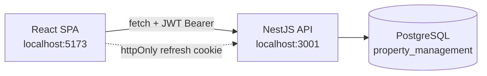

---

# 2. System Architecture

## 2.1 High-Level Topology

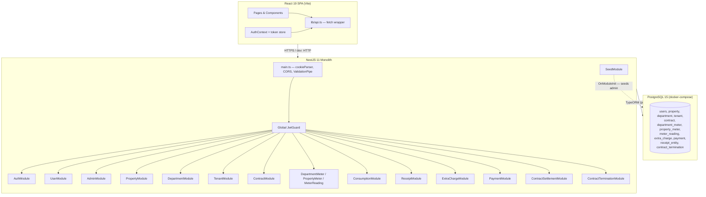

## 2.2 Frontend Architecture

- **Routing model.** `App.tsx` wraps the entire tree in `AuthProvider` and `BrowserRouter`. Two public routes (`/login`, `/register`) are mounted outside the protected shell. All other routes are wrapped in `<ProtectedRoute>` → `<Layout>` (sidebar + main outlet). The admin route `/admin/users` is additionally wrapped in `<AdminRoute>` which requires `user.role === 'admin'`.
- **Auth state.** Lives in `src/contexts/AuthContext.tsx`. On mount it tries a **silent refresh** against `POST /auth/refresh` (using the `httpOnly` `refreshToken` cookie). If that returns an access token, it decodes the JWT payload client-side to populate `{ sub, email, role }`.
- **Network client.** `src/lib/api.ts` exposes `apiFetch / apiPost / apiPatch / apiDelete`. The wrapper holds a module-level `_accessToken` and a `_onRefresh` callback registered by `AuthContext`. On any `401` it transparently calls `_onRefresh()` once, then retries the original request with the new token.
- **Toasts.** `sonner` provides top-right toasts. `lib/toast.ts` exposes `showSuccess` / `showError` helpers used throughout pages.
- **Styling.** Tailwind v4 with semantic design tokens declared in `index.css` (e.g. `bg-surface`, `text-on-surface-muted`, `bg-status-warning-bg`). Dark mode is class-based (`.dark` on `<html>`), persisted in `localStorage` by `useTheme.ts` and toggled from the sidebar. Reusable class strings live in `lib/styles.ts` (`inputCls`, `btnPrimaryCls`, `cardCls`, table helpers).
- **State management.** No global state library. Each page owns its own `useState` + `useEffect` + `fetch` lifecycle. Cross-page data is *not* shared — pages refetch on mount. This is acceptable for the size of the app but is the largest source of duplicated network logic.
- **Page sizes.** The two biggest pages are `DepartmentBilling.tsx` (~1.2k lines) and `PropertyDetail.tsx` (~1.5k lines). These mix data fetching, business logic, modal state, multiple sub-views, and inline form handlers — see [§11 Known Risks](#11-known-risks--technical-debt).

## 2.3 Backend Architecture

- **Bootstrap (`apps/api/src/main.ts`).** Enables `cookieParser`, CORS for `http://localhost:5173` with credentials, and a global `ValidationPipe({ whitelist: true, transform: true })` (so DTOs strip unknown fields and coerce types). Listens on `PORT || 3001`.
- **Global guard.** `app.module.ts` registers `JwtGuard` as `APP_GUARD`. **Every** request is authenticated unless a route is decorated with `@Public()` (currently only `auth/register`, `auth/login`, `auth/refresh`).
- **Role guard.** `RolesGuard` is applied to `AdminController` only (`@UseGuards(RolesGuard) @Roles('admin')`). It reads the `role` claim from the JWT payload populated by `JwtGuard` on the request object.
- **Refresh guard.** `JwtRefreshGuard` reads the `refreshToken` from cookies (set by `AuthService.issueTokens`), verifies it against `JWT_REFRESH_SECRET`, and attaches `{ sub, email, role, rawToken }` to `request.user` so the controller can hash-compare against the stored `refreshTokenHash`.
- **Module structure.** Each domain (Property, Department, Contract, …) follows the canonical NestJS triplet: `*.module.ts` registers TypeORM repositories + controller + service; `*.controller.ts` exposes REST endpoints; `*.service.ts` holds business logic; `entities/*.entity.ts` declares TypeORM tables; `dto/*.dto.ts` enforces input validation with `class-validator`.
- **No service-to-service HTTP.** Cross-module calls are direct service-to-service injection. Example: `ReceiptService` depends on `ConsumptionService`, `ContractTerminationService` depends on `ContractRepository` and `DepartmentRepository`.

## 2.4 Database Architecture

- PostgreSQL 15 running via `docker-compose.yml` on `localhost:5432`.
- TypeORM is configured with `autoLoadEntities: true` and **`synchronize: true`**. This auto-creates/updates the schema from entity decorators on every boot. **There are no migrations.** This is great for prototype velocity and dangerous for production: any entity rename or column-type change silently rewrites the table.
- Entity → table naming: TypeORM uses lower-case singular table names by default (e.g. `property`, `department`, `contract`, `payment`, `receipt_entity`, `contract_termination`). The only explicitly named entity is `User` (`@Entity('users')`).
- A unique constraint `uq_receipt_contract_period` on `(contract_id, month, year)` enforces one issued receipt per contract per period.

## 2.5 Authentication Flow

```mermaid
sequenceDiagram
    autonumber
    actor U as User (browser)
    participant FE as React SPA
    participant API as NestJS API
    participant DB as PostgreSQL

    Note over FE: On app mount
    FE->>API: POST /auth/refresh (cookie: refreshToken)
    API->>API: JwtRefreshGuard verifies cookie
    API->>DB: SELECT user by id; bcrypt.compare(rawToken, refreshTokenHash)
    alt valid
        API->>API: issue new access + refresh
        API->>DB: UPDATE user.refreshTokenHash = bcrypt(newRefresh)
        API-->>FE: { accessToken } + Set-Cookie refreshToken
        FE->>FE: decode JWT → user state
    else missing / invalid
        API-->>FE: 401
        FE->>FE: render /login
    end

    U->>FE: enter email + password
    FE->>API: POST /auth/login
    API->>DB: bcrypt.compare(password, user.passwordHash)
    API->>API: check status != pending/rejected
    API->>API: issue tokens + store refreshTokenHash
    API-->>FE: { accessToken } + Set-Cookie refreshToken

    Note over FE,API: Every subsequent call
    FE->>API: Authorization: Bearer <accessToken>
    API->>API: JwtGuard verifies access token
    API-->>FE: 200 / 401

    Note over FE: On 401 (e.g. expired)
    FE->>API: POST /auth/refresh (cookie)
    API-->>FE: { accessToken }
    FE->>API: retry original request
```

**Key properties:**
- Access tokens default to **15 minutes** (`JWT_ACCESS_EXPIRES_IN=15m`), refresh tokens to **7 days** (`JWT_REFRESH_EXPIRES_IN=7d`).
- The refresh token is **rotated on every refresh** (`issueTokens` rewrites the hash on every call), implementing one-time-use refresh tokens.
- Logout server-side **nulls the `refreshTokenHash`** in DB and clears the cookie, immediately invalidating any further refresh attempts (defense in depth against stolen cookies).

## 2.6 Event-Driven Patterns, Queues, Cron Jobs

**None exist.** The system is fully synchronous. The only "scheduled-feeling" feature is the late-fee mechanism, but it is **operator-triggered** (the operator clicks a button to compute and persist a `late_fee` extra charge). The system never proactively runs anything except the admin-seed `OnModuleInit` hook in `SeedService`.

## 2.7 Why this architecture was likely chosen

| Decision | Rationale |
| :-- | :-- |
| Monolith over microservices | Single operator-facing tool with one DB. Microservice overhead would be unjustified. |
| TypeORM `synchronize: true` | Lets the developer iterate on the schema without ceremony; appropriate for a single-tenant prototype. |
| JWT + httpOnly refresh cookie | Standard SPA pattern that resists XSS theft of refresh tokens while allowing JS access to short-lived access tokens. |
| No state library on frontend | The data graph is small enough that per-page fetching is simpler than centralizing it. |
| Tailwind v4 with semantic tokens | Enables painless dark-mode pairs without rewriting CSS. |

## 2.8 Tradeoffs & Coupling Concerns

- **Hardcoded DB credentials.** `app.module.ts` literally bakes `user / password / localhost / 5432` into source code. There is no `DATABASE_URL` env var. This is a deployment blocker.
- **`synchronize: true`** is unsafe in production — see §11.
- **Large page components.** Two pages exceed 1k lines and own their own networking and state; refactoring is overdue.
- **No transaction around contract creation.** `ContractService.create` updates `department.isAvailable = false` and saves the contract as **two separate operations**. A crash between them leaves orphan state. Same applies to several other multi-write paths.
- **No tenant scoping.** There is no organization/tenant model — every authenticated user can read/write **everything**. The system effectively assumes a single landlord per deployment.

---

# 3. Domain / Module Breakdown

> Each subsection follows the same template: Purpose · Responsibilities · Key Components · Data Flow · Business Rules · Edge Cases · Dependencies · Consumers · Failure Scenarios · Observability · Tech Debt · Diagram.

## 3.1 Authentication

### Purpose
Authenticate the operator persona against the `users` table and issue short-lived access tokens (JWT) plus rotating refresh tokens.

### Main Responsibilities
- Hash passwords (bcrypt, cost 10) on registration.
- Validate credentials at login.
- Issue/rotate JWT access + refresh tokens.
- Store the **hash** of the active refresh token server-side for revocation.
- Verify any request that lacks `@Public()` metadata via the global `JwtGuard`.
- Refresh access tokens transparently when expired (frontend `silentRefresh`).
- Logout (revoke refresh token hash + clear cookie).

### Key Components

| File | Role |
| :-- | :-- |
| `apps/api/src/auth/auth.controller.ts` | Exposes `/auth/register`, `/auth/login`, `/auth/refresh`, `/auth/logout`, `/auth/me`. |
| `apps/api/src/auth/auth.service.ts` | Implements `register`, `login`, `refresh`, `logout`, `issueTokens`. |
| `apps/api/src/auth/guards/jwt.guard.ts` | Global access-token guard, checks `Authorization: Bearer …`. |
| `apps/api/src/auth/guards/jwt-refresh.guard.ts` | Verifies refresh token from cookies, exposes raw token to the controller. |
| `apps/api/src/auth/guards/roles.guard.ts` | Reads `roles` metadata, throws `ForbiddenException` if mismatch. |
| `apps/api/src/auth/decorators/{public,roles,current-user}.decorator.ts` | Metadata helpers + `@CurrentUser()` param decorator. |
| `apps/client/src/contexts/AuthContext.tsx` | Holds access token in module memory; registers a silent-refresh callback with `lib/api.ts`. |

### Data Flow

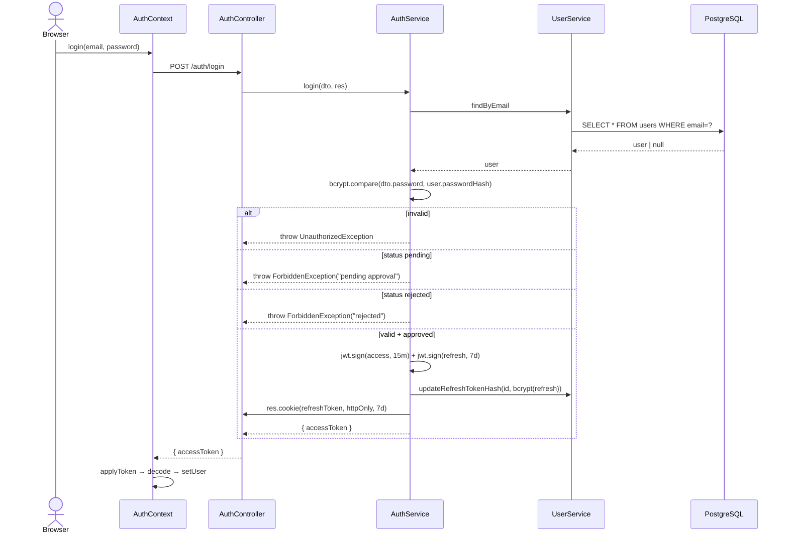

### Business Rules

- A newly registered user is created with `status = 'pending'`; they **cannot** log in until an admin approves them.
- A user with `status = 'rejected'` receives `403 "Your account has been rejected"` on login attempts.
- The cookie is `httpOnly`, `sameSite: 'lax'`, `path: '/'`, expires in `7 days`. **It is not `secure`** — see §11.
- Password minimum length is **8 chars** (enforced via `class-validator` `MinLength(8)` in `RegisterDto`).
- The first request after page load triggers a **silent refresh** so the SPA can hydrate the auth state from the cookie without a visible login prompt.

### Edge Cases

| Case | Behavior |
| :-- | :-- |
| Login when account is `pending` | `403 Forbidden — pending admin approval`. |
| Refresh when DB has been wiped (no `refreshTokenHash`) | `401 Unauthorized`. |
| Refresh with valid cookie but mismatched hash (e.g. user logged in elsewhere → rotation invalidated this device) | `401 Unauthorized`. The user falls back to the login page. |
| Network failure during silent refresh | `silentRefresh` catches the error, returns `null`, app routes to `/login`. |
| Multiple browser tabs | Each tab calls `/auth/refresh` on mount. Because the refresh token is rotated on each call, **the last tab wins** and the other tabs will get a 401 on their next refresh attempt. This is a known limitation. |
| Logout while access token is still valid | The cookie is cleared and `refreshTokenHash` is nulled, but the access token (which is stateless) remains technically valid until expiry (≤ 15 min). |

### Dependencies
- `UserModule` (for user CRUD + `updateRefreshTokenHash`).
- `JwtModule` (registered empty in `AuthModule` and consumed elsewhere; secrets/expiry are passed per `signAsync` call).
- `ConfigModule` (reads env vars).

### Consumers
- Every other backend module via the global `JwtGuard`.
- `AdminController` via `RolesGuard`.
- The frontend `AuthContext` and `lib/api.ts`.

### Security Considerations
- Refresh-token rotation closes the window for replay attacks: a stolen cookie is single-use.
- `passwordHash` and `refreshTokenHash` use bcrypt cost 10. There is no rate limiting on `/auth/login`, which is a credential-stuffing risk (§11).
- The JWT payload contains `{ sub, email, role }`. **The frontend decodes this payload without verifying its signature** (it cannot — the secret is server-side) and uses the `role` claim to choose UI. This is fine for UX, but **all authorization decisions still happen server-side** in `RolesGuard`.

### Failure Scenarios
- `JWT_ACCESS_SECRET` / `JWT_REFRESH_SECRET` missing → `jwt.verify` throws → guard responds `401`. The whole app is effectively dead until env vars are restored.
- DB outage during login → `UserService.findByEmail` rejects → uncaught exception → NestJS responds `500`.

### Observability
- **No structured logging** in the auth service. Only generic Nest logger output from boot. Login failures are not audited.

### Technical Debt / Risks
- No rate limiting on login or refresh.
- Cookies are not `secure`. Acceptable in dev but must be hardened for prod.
- Frontend stores the access token in a module-level variable in `lib/api.ts` (re-set from `AuthContext`). A full page reload erases it and triggers a silent refresh. Acceptable.

---

## 3.2 User & Admin Approval

### Purpose
Manage the operator-level user lifecycle: registration → approval gate → admin moderation.

### Main Responsibilities
- Persist users with `email`, `passwordHash`, `role`, `status`, `isActive`.
- Provide list/lookup methods used by `AuthService` and `AdminController`.
- Allow an admin to list all non-admin users and approve/reject them.

### Key Components

| File | Role |
| :-- | :-- |
| `apps/api/src/user/entities/user.entity.ts` | TypeORM entity `users`. |
| `apps/api/src/user/user.service.ts` | `create`, `findByEmail`, `findById`, `updateRefreshTokenHash`, `createAdmin`, `findAdmin`, `findAllNonAdmin`, `updateStatus`. |
| `apps/api/src/admin/admin.controller.ts` | `GET /admin/users`, `PATCH /admin/users/:id/approve`, `PATCH /admin/users/:id/reject`. Guarded by `RolesGuard + @Roles('admin')`. |
| `apps/client/src/pages/admin/AdminUsers.tsx` | Operator-facing approval/rejection UI. |

### Data Flow

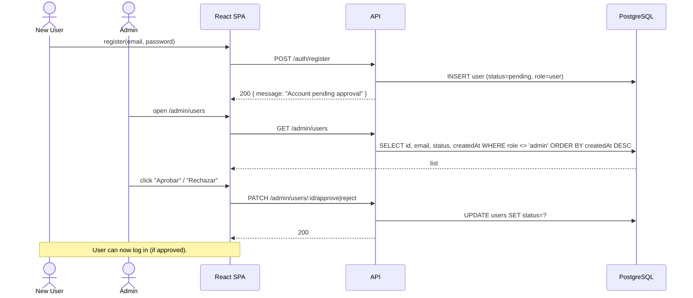

### Business Rules
- A user is `pending` by default; only an admin can flip to `approved` or `rejected`.
- Admin self-registration is **not possible** through `/auth/register`. The only admin path is the boot-time seed (`SeedService`).
- `findAllNonAdmin` explicitly excludes admins from the list (`Not('admin')`) and only selects `id, email, status, createdAt` — passwords and refresh hashes are never exposed.

### Edge Cases
- Duplicate registration with the same email → `ConflictException ("Email already in use")` from `UserService.create`.
- Admin tries to approve themselves → not exposed in the UI (admin is filtered out of the list).
- A rejected user re-attempts login → blocked with `403`.

### Dependencies
- `AuthModule` for password hashing flows.
- `RolesGuard` for admin authorization.

### Consumers
- `AuthService` (login flow checks `status`).
- `SeedService` (creates admin on boot).
- `AdminUsers.tsx` page.

### Failure Scenarios
- DB connection error during approval → 500 returned to UI → toast `"Error al actualizar el estado"`.
- Concurrent updates: two admins approving the same user simultaneously → last write wins, no audit trail.

### Observability
- Admin actions are **not logged**.

### Technical Debt / Risks
- No audit log of approve/reject decisions.
- No email notification to the user on approval/rejection. The user must blindly try logging in.
- No way to deactivate a previously-approved user without DB intervention (no "suspend" action surfaces in the controller).

---

## 3.3 Property

### Purpose
Top-level inventory entity representing a physical building. Owns per-unit utility cost rates.

### Main Responsibilities
- CRUD on `Property` entities (`id`, `name`, `address`, `lightCostPerUnit`, `waterCostPerUnit`).
- Expose `GET /properties/:id/tenants` (deduplicated tenants who have contracted on any department of this property) and `GET /properties/:id/departments`.
- **Cascade-delete** the entire property tree atomically (departments, meters, contracts, payments, extra charges, and orphan tenants).

### Key Components

| File | Role |
| :-- | :-- |
| `apps/api/src/property/entities/property.entity.ts` | Entity with `lightCostPerUnit` (default `0.25`) and `waterCostPerUnit` (default `0.15`). |
| `apps/api/src/property/property.service.ts` | CRUD + the cascading `remove()` transaction. |
| `apps/api/src/property/property.controller.ts` | REST endpoints. |
| `apps/client/src/pages/Properties.tsx` | List/create UI. |
| `apps/client/src/pages/PropertyDetail.tsx` | Property dashboard (1.5k lines — multiple sub-sections). |

### Data Flow — Cascading Delete

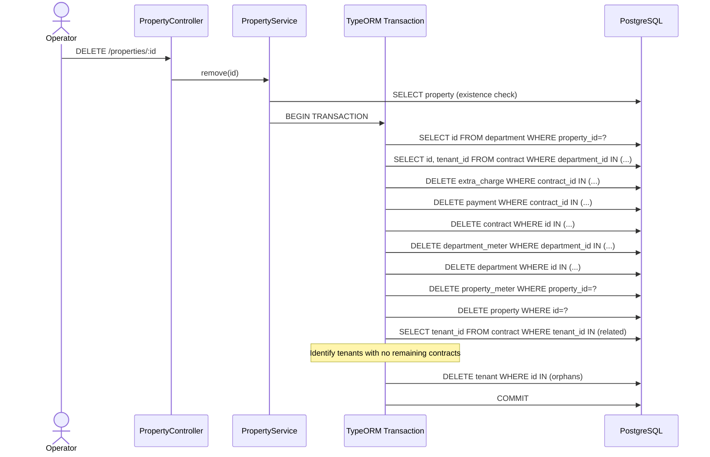

### Business Rules
- Costs per utility unit are stored as `DECIMAL(10,4)` to allow micro-rates (e.g. `0.2543/kWh`).
- Deleting a property is **destructive**: it removes the whole tree (contracts → payments → extra charges) and orphan tenants. Tenants with contracts at other properties are preserved.
- Receipts (`receipt_entity`) are **not** explicitly deleted by `PropertyService.remove`. However, the `ReceiptEntity → Contract` FK has `onDelete: 'CASCADE'`, so PostgreSQL will cascade them automatically when the contract row is removed.
- Similarly, `MeterReading` rows are cascaded by the `DepartmentMeter` FK `onDelete: 'CASCADE'`.

### Edge Cases
- Property does not exist → `NotFoundException` from `findOne`.
- Property has no departments → only the property row is deleted; the transaction still runs through every step safely.
- Tenant has contracts on **two** properties → only the orphan-cleanup step is conditional (`!tenantIdsWithContracts.has(tenantId)`), so the tenant is preserved.

### Dependencies
- All other domain entities are repositoried/queried in the transactional delete.

### Consumers
- The frontend `Properties.tsx` (list + create), `PropertyDetail.tsx` (detail), and pages that fetch `/properties/:id/departments` for selectors.

### Failure Scenarios
- A transient DB error mid-transaction → entire transaction rolls back; the property remains intact.
- `findOne` throws → 404 returned → toast `"Error al eliminar propiedad"`.

### Observability
- No structured logs.

### Technical Debt / Risks
- The cascade is hand-rolled instead of relying entirely on `onDelete: 'CASCADE'`. This is intentional (the service needs to identify orphan tenants), but it duplicates DB knowledge in service code.

---

## 3.4 Department (Rental Unit)

### Purpose
Represents one rentable unit inside a property (apartment, studio, room…).

### Main Responsibilities
- CRUD on `Department` (`name`, `floor`, `numberOfRooms`, `propertyId`, `isAvailable`).
- Optionally **bootstrap** the department with an initial water and/or electricity meter and its first reading on creation.
- Toggle `isAvailable` when contracts open/close.

### Key Components

| File | Role |
| :-- | :-- |
| `apps/api/src/department/entities/department.entity.ts` | Entity. |
| `apps/api/src/department/department.service.ts` | `create` (with optional initial readings), `findAll`, `findOne`, `update`, `remove`. |
| `apps/api/src/department/dto/create-department.dto.ts` | Accepts optional `initialWaterReading`, `initialElectricityReading`, dates, billing month/year. |
| `apps/client/src/pages/Departments.tsx`, `DepartmentDashboard.tsx`, `DepartmentBilling.tsx` | List, per-department dashboard, and per-period billing UI. |

### Data Flow — Department creation with initial readings

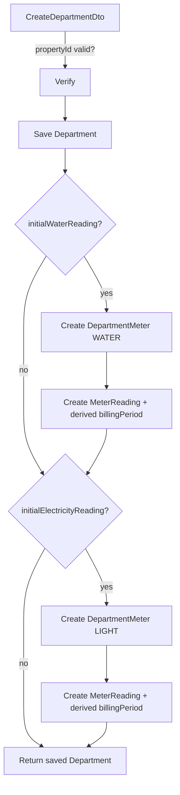

### Business Rules
- `isAvailable` defaults to `true`. The **`ContractService.create`** flips it to `false`; the **`ContractService.remove`** flips it back; the **`ContractTerminationService.terminate`** also flips it back.
- The `initialBillingMonth/Year` lets the operator place the first reading in a non-current billing period (useful when seeding historical data).
- `resolveBillingPeriod` has a subtle rule: if the reading falls on **day 1 of the month**, it is attributed to the **previous month** (under the assumption that a day-1 reading reflects the closing state of the prior month).

### Edge Cases
- `propertyId` invalid → `BadRequestException`.
- `initialWaterReadingDate` malformed → `BadRequestException("Invalid initial water reading date")`.
- Creating a department, then trying to create another contract for it while one is active → `BadRequestException("Department is not available for rent")` from `ContractService.create`.

### Dependencies
- `Property`, `DepartmentMeter`, `MeterReading` repositories.

### Consumers
- `ContractService`, `ConsumptionService`, `ReceiptService`, `Properties.tsx`, `PropertyDetail.tsx`, `Contracts.tsx`, `Meters.tsx`, `MeterReadings.tsx`, `DepartmentBilling.tsx`, `DepartmentDashboard.tsx`.

### Failure Scenarios
- If the initial-reading inserts fail after the department is saved, the department remains in the DB with no meters. **There is no transaction wrapping these operations.**

### Observability
- No logs.

### Technical Debt / Risks
- The reading-date → billing-period derivation is duplicated in both `DepartmentService` and `MeterReadingService.deriveBillingPeriod`. Drift risk.
- No transactional boundary around the create+bootstrap operation.

---

## 3.5 Tenant

### Purpose
The person renting a unit. Not a system user — purely a domain entity tied to contracts.

### Main Responsibilities
- CRUD on `Tenant` (`name`, `email` unique, optional `phone`, optional `documentId`).

### Key Components
- `apps/api/src/tenant/entities/tenant.entity.ts`
- `apps/api/src/tenant/tenant.service.ts`
- `apps/api/src/tenant/tenant.controller.ts` (standard REST)
- `apps/client/src/pages/Tenants.tsx`, `TenantDashboard.tsx`

### Business Rules
- `email` is `UNIQUE` at the DB level. Trying to create a second tenant with the same email will throw a DB constraint violation surfaced as a 500/`Bad Request` upstream.

### Edge Cases
- Deleting a tenant who still has contracts will fail at the FK level (no explicit handling — the service just calls `remove`). The Frontend `Tenants.tsx` proactively filters/asks before delete in some views but the service itself does not pre-check.

### Consumers
- `ContractService` (resolves tenant on create).
- `PropertyService` (orphan-tenant cleanup).

---

## 3.6 Contract

### Purpose
Binds one tenant to one department for a date range, capturing rent, advance payment, and security deposit.

### Main Responsibilities
- CRUD on `Contract`.
- Block creation if the department is unavailable.
- Mark the department unavailable on create, available again on delete or termination.
- Aggregate-root for billing: most receipt/payment/extra-charge/late-fee/termination endpoints are nested under `/contracts/:id/*`.

### Key Components

| File | Role |
| :-- | :-- |
| `apps/api/src/contract/entities/contract.entity.ts` | Entity, including `status` enum `ACTIVE | TERMINATED`. |
| `apps/api/src/contract/contract.service.ts` | CRUD with department-availability invariant. |
| `apps/api/src/contract/contract.controller.ts` | `/contracts` + nested receipt/settlement/termination endpoints. |
| `apps/api/src/contract/dto/create-contract.dto.ts` | Validates UUIDs, dates, numeric amounts. |

### Data Flow

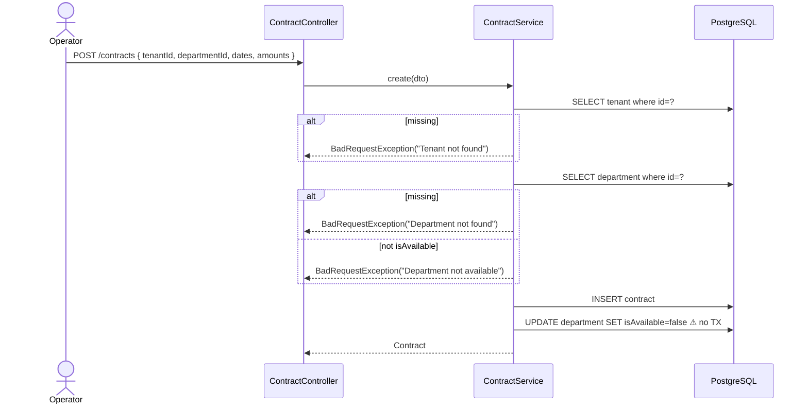

### Business Rules
- One active contract per department (enforced via `isAvailable`, not via DB constraint).
- Contract `status` is `ACTIVE` by default; only `ContractTerminationService` flips it to `TERMINATED`.
- The controller exposes a special list endpoint `GET /contracts/receipts/pending` (delegates to `ReceiptService.findPendingReceipts`) declared **before** `GET /contracts/:id` to avoid route shadowing — this is route-order-sensitive and brittle.

### Edge Cases
- The frontend `Contracts.tsx` filters out unavailable departments from the selector so users don't see them, but the backend is the source of truth.
- Deleting a contract with payments/extra-charges/receipts: cascading is via DB FK (`onDelete: 'CASCADE'` on Payment and Receipt). `ExtraCharge.contract` is **not** declared with cascade, so DELETE may fail if extra charges exist. Test path: see `contract.service.spec.ts`.

### Dependencies
- `Tenant`, `Department` repositories.
- `ReceiptService`, `ContractSettlementService`, `ContractTerminationService` (composed inside the controller).

### Consumers
- Receipts, payments, extra charges, settlements, terminations all FK to Contract.

### Failure Scenarios
- The create transaction is **not atomic**: a crash between `INSERT contract` and `UPDATE department.isAvailable=false` leaves the department available + the contract live. Frontend logic and `ContractService.create` will then permit a second contract on the same department until the first is detected.

### Observability
- No logs.

### Technical Debt / Risks
- Missing transactional boundary on create.
- The "one active contract per department" rule lives only in `isAvailable`; there is no unique constraint or overlap check by date.
- `findAll` builds `where` from query params without a type-safe DTO.

---

## 3.7 Department Meter & Property Meter

### Purpose
Represent the physical utility meters attached to each rental unit (`DepartmentMeter`) or to the building common-area (`PropertyMeter`).

### Main Responsibilities
- CRUD on each meter type with `meterType: LIGHT | WATER`.
- Cascade-delete readings (`MeterReading.departmentMeter` has `onDelete: 'CASCADE'`).

### Notes
- `PropertyMeter` exists for completeness (e.g. building-wide water meter) but is **not wired into consumption calculations**. The receipt/consumption services only read from `DepartmentMeter` + `MeterReading`. Likely intended for future common-area cost splitting.

### Files
- `apps/api/src/department-meter/{entities,dto,*.{controller,service,module}.ts}`
- `apps/api/src/property-meter/{entities,dto,*.{controller,service,module}.ts}`

---

## 3.8 Meter Reading

### Purpose
A timestamped reading value for a `DepartmentMeter`, with optional explicit `billingMonth`/`billingYear` overriding the auto-derived period.

### Main Responsibilities
- Persist readings with billing-period attribution.
- Derive billing month/year from the reading date when not provided.

### Key Components
- `apps/api/src/meter-reading/entities/meter-reading.entity.ts`
- `apps/api/src/meter-reading/meter-reading.service.ts`
- `apps/api/src/meter-reading/meter-reading.controller.ts`
- `apps/client/src/pages/MeterReadings.tsx`

### Business Rules
- `deriveBillingPeriod(date)`: if `date.getDate() === 1`, attribute to the previous month; else to `date.getMonth() + 1`. This is so a 1-st-of-month reading (which captures the prior month's consumption) is credited correctly.
- The reading date is normalized to noon (`new Date(date + 'T12:00:00')`) to avoid UTC-vs-local off-by-one issues across timezones.

### Edge Cases
- Negative consumption (current reading < previous reading) is logged as a `warn` in `ConsumptionService` and treated as `0` — see §3.9.
- Updating only the date will re-derive the billing period (unless explicit `billingMonth`/`billingYear` are sent).

### Observability
- `MeterReadingService` uses `Logger`. Logs: `Creating reading…`, `Meter resolved…`, `Previous reading…`, `Reading saved…`. Reading creation is the only well-instrumented backend operation.

---

## 3.9 Consumption Calculation

### Purpose
Compute the difference between two relevant readings to bill utility usage at a property-specific rate.

### Main Responsibilities
- `calculateConsumptionForPeriod(deptId, type, month, year, startDay?, endDay?)` — billing-period-scoped query.
- `calculateCurrentConsumption(deptId)` — "latest two readings" — used for live dashboards and as a UI fallback when no receipt exists.

### Two Modes

**Period mode** (when `startDay`/`endDay` are provided):
- `currentReading` = newest reading with `date <= rangeEnd`.
- `previousReading` = newest reading with `date < rangeStart`.
- Used when prorating partial-month tenancies (e.g. tenant left on day 15).

**Billing-period mode** (when only `month`/`year`):
- `currentReading` = newest reading where `billingMonth = month AND billingYear = year`.
- `previousReading` = newest reading with `(billingYear < year OR (billingYear = year AND billingMonth < month))`.

Both modes apply `consumption = current - previous`, treat negative results as `0` (with a logged warning), and use the property's `lightCostPerUnit` / `waterCostPerUnit` (with hardcoded defaults `0.25` / `0.15` if the property cannot be resolved).

### Edge Cases

| Case | Behavior |
| :-- | :-- |
| No meter for `(departmentId, meterType)` | Returns `{ consumption: 0, cost: 0 }`. |
| Only one reading exists | Returns `{ consumption: 0, cost: 0 }`. |
| Current reading < previous (meter rollback, replaced meter, manual edit) | Logged as warning; returned as `0` so receipts never go negative on consumption. |
| Property record is missing | Falls back to hardcoded constants. |
| Reading dates outside the requested range | Period mode picks the last-on-or-before for current and the last-strictly-before for previous, so consumption is bounded by the requested range. |

### Files
- `apps/api/src/consumption/consumption.service.ts`
- `apps/api/src/consumption/consumption.controller.ts` (exposes `/departments/:id/consumption` and `/departments/:id/consumption/period`).

### Technical Debt / Risks
- Hardcoded fallback constants `0.25` and `0.15` could mask configuration mistakes.
- The "current = latest in billing period" rule means **a reading taken at any point in the billing month becomes the current value**. If an operator enters two readings in the same billing month, only the most recent (by date) is used — earlier readings in that month are ignored.

---

## 3.10 Extra Charges (Manual & Late Fees)

### Purpose
Add ad-hoc line items to a receipt for a given period: cable TV, cleaning, maintenance, or auto-computed late fees.

### Main Responsibilities
- CRUD on `ExtraCharge` (manual).
- `POST /extra-charges/late-fee` — auto-generate or update a `LATE_FEE` charge based on an unpaid receipt.

### Key Components
- `apps/api/src/extra-charge/entities/extra-charge.entity.ts` — type enum `MANUAL | LATE_FEE`, optional `sourceReceiptId`, `ratePerDay`, `daysOverdue`.
- `apps/api/src/extra-charge/extra-charge.service.ts`

### Late-Fee Algorithm

1. Fetch the receipt `(contractId, month, year)`. If missing → 404.
2. If `receipt.balance >= 0` → `BadRequestException("No late fee applicable")`. **Balance is positive when payments exceed charges**, so this guards against penalizing tenants who are paid up.
3. Compute the grace deadline: **day 15 of the month following the receipt's billing month** (`new Date(year, month, 15)` — note that `month` is **1-indexed** for receipts but `new Date` expects **0-indexed**, so `month=3` → `new Date(year, 3, 15)` is **April 15**, i.e. **15 days into the month after billing**).
4. If today is on or before the deadline → `BadRequestException("not yet overdue")`.
5. Compute `daysOverdue = floor((today - deadline) / dayMs)`.
6. `amount = ratePerDay * daysOverdue`.
7. Upsert: if a `LATE_FEE` already exists with this `sourceReceiptId`, update its `amount`, `ratePerDay`, `daysOverdue`, `description`. Else insert a new one.
8. Description: `Mora por recibo atrasado (N dias x S/ R/dia)`.

### Business Rules
- A `LATE_FEE` cannot be deleted manually (`remove()` throws `BadRequestException` if `type === LATE_FEE`). The operator must regenerate or wait for the receipt to be repaid.
- A `MANUAL` extra charge can be deleted.
- `ExtraCharge.month/year` are 1-indexed integers (no DB constraint validating range — relies on the DTO).

### Edge Cases
- Late fee generation runs multiple times per day → each call recomputes from "today"; the same row is updated. Multiple receipts in different periods produce independent fee rows.
- Time-of-day matters: `today.setHours(0,0,0,0)` is used so the comparison is at-day granularity in **server local time**.
- Currency is hardcoded as `S/` (Peruvian sol) in description strings.

### Dependencies
- `ReceiptEntity` repository to look up the receipt by `(contractId, month, year)`.
- `Contract` repository (the late-fee row carries a `contractId`).

### Observability
- `Logger` logs at INFO when a late fee is created or updated, including days and amount.

### Technical Debt / Risks
- The grace-period offset is hardcoded to **15** days into the month *after* the billing period. There is no way to configure this per property, per tenant, or even globally.
- The amount comparison uses `Number(receipt.balance)` — but receipts store `balance = totalPayments - totalDue`, so `balance >= 0` means the tenant is *up to date or in credit*. The semantic is correct but the variable name `balance` invites confusion.
- A late fee is itself an extra charge **for the same period** as the receipt. When the receipt is regenerated, the new receipt will include the late fee as a line item, increasing `totalDue`, and the next late-fee call will re-base off that higher `totalDue`. This **does not double-count** because the late-fee amount is recomputed from scratch (not incrementally), but it is a subtle compound interaction worth flagging.

---

## 3.11 Payment

### Purpose
Record money received from a tenant against a contract, categorized by `PaymentType`.

### Main Responsibilities
- CRUD on `Payment` (`amount`, `date`, `description`, `type`, `contractId`).

### Payment Types
`RENT`, `WATER`, `LIGHT`, `ADVANCE`, `GUARANTEE`, `REFUND`.

### Receipt Integration
`ReceiptService.calculateReceipt` queries `payments WHERE contract_id = ? AND date BETWEEN periodStart AND periodEnd`. Payments are included as **negative-amount line items** (`-Number(payment.amount)`) in the receipt's `items` array, and aggregated into `totalPayments`. **The payment's `type` is informational only** — it is rendered into the description but does not change the math.

### Edge Cases
- A payment dated outside the billing period is **not** counted by the receipt for that period (it will instead surface in its own period's receipt). This means an advance payment must be dated within the relevant month or it will be invisible to that month's receipt.
- Deleting a payment cascades nothing else but does change the next receipt regeneration's balance.

### Files
- `apps/api/src/payment/entities/payment.entity.ts`
- `apps/api/src/payment/payment.{service,controller,module}.ts`
- `apps/client/src/pages/Payments.tsx`

### Technical Debt / Risks
- The "balance" tracked in receipts is computed at receipt-issue time — but if a payment is added later (after the receipt is approved), the receipt does **not** auto-update. The operator must regenerate.
- There is no idempotency: posting the same payment twice creates two rows.

---

## 3.12 Receipt (Monthly Billing)

### Purpose
The central billing artifact. For one `(contractId, month, year)` triple, produce the line-item bill the tenant receives.

### Main Responsibilities
- **Preview** a receipt (`previewReceipt`): if one already exists, return the persisted version verbatim; else compute on the fly without persisting.
- **Issue** a receipt (`issueReceipt`): always recalculate, then upsert into the `receipt_entity` table with `status = PENDING_REVIEW`.
- **Update status** (`approve` / `deny`).
- **List pending** (`findPendingReceipts`): sorted by year-desc, month-desc.
- The unique constraint `uq_receipt_contract_period` enforces one row per `(contractId, month, year)`.

### Receipt Composition

```mermaid
flowchart LR
    subgraph Inputs
        C[Contract.rentAmount]
        L[Light consumption for period]
        W[Water consumption for period]
        EC[ExtraCharges for month/year]
        P[Payments with date in period]
    end

    C --> Calc[ReceiptService.calculateReceipt]
    L --> Calc
    W --> Calc
    EC --> Calc
    P --> Calc

    Calc -->|items[]| Items
    Calc -->|totalDue = rent + utilities + extras| TD[totalDue]
    Calc -->|totalPayments = Σpayments.amount| TP[totalPayments]
    Calc -->|balance = totalPayments - totalDue| B[balance]
```

### Proration Rules
When `endDay` is provided and `prorateRent === true`:
- `effectiveStartDay = startDay ?? 1`
- `daysInMonth = new Date(year, month, 0).getDate()`
- `daysOccupied = endDay - effectiveStartDay + 1`
- `rentAmount = (daysOccupied / daysInMonth) * contract.rentAmount`
- The rent description becomes `Monthly Rent (X/Y days)`.

The utilities then use the `startDay`/`endDay` to scope the consumption calc as well (see §3.9 Period mode).

### Status Workflow

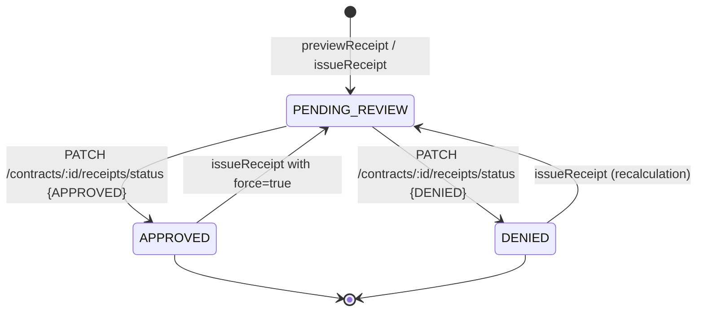

**Force semantics:** `issueReceipt(... , force=true)` is required to regenerate an `APPROVED` receipt. Without force, an attempt throws `BadRequestException`. This prevents accidental rewrites of already-sent bills.

### Business Rules
- Rent is **always** included, even if `0` (defensive — entity allows decimal but no zero filter).
- Light/water lines are included **only if `consumption > 0`** — i.e. you don't see a "0 units" line.
- Payments are inserted at the end of the `items[]` array; their amounts are stored as negative numbers.
- `period` is rendered like `"5 March 2026"` or `"1–15 March 2026"` for prorated ranges.

### Edge Cases
- No contract found → `NotFoundException`.
- Existing receipt for the same `(contractId, month, year)` blocks reissue unless `force=true` (and only if `APPROVED`).
- Payments at the **last second** of the last day of the month — TypeORM `Between(periodStart, periodEnd)` is inclusive on both ends; `periodEnd = new Date(year, month, 0)` is the last day of the month at midnight local time, which means payments timestamped during day 0 of the month after may be missed. Safer practice: payment dates are stored as `date` (not `timestamp`), so the comparison is day-level and unambiguous.

### Dependencies
- `Contract`, `Payment`, `ExtraCharge`, `ReceiptEntity` repositories.
- `ConsumptionService`.

### Consumers
- `ContractController` (preview/issue/status).
- `ExtraChargeService.generateLateFee` reads the receipt.
- `Tenants.tsx` shows pending receipts via `/contracts/receipts/pending`.

### Failure Scenarios
- Idempotency: `issueReceipt` does a `findOne` then `save`. Two near-simultaneous issues could both find `null` and both attempt to insert, but the unique constraint will reject one with a 500.
- Recalculating after `force=true` resets status to `PENDING_REVIEW`. If the receipt was already sent to the tenant externally (e.g. via WhatsApp), the external copy is now stale.

### Observability
- No logs in `ReceiptService`.

### Technical Debt / Risks
- `items` is stored as `jsonb`. There is no schema enforcement on the JSON; a future code change can silently break parsing.
- Money is `DECIMAL(10,2)` but flows through JavaScript `Number` in the service. Sums use `+` on numbers cast from strings (TypeORM returns decimals as strings by default), and the service consistently calls `Number(...)`. Acceptable for now but prone to floating-point drift on large or many-line invoices.

### Mermaid — Issue Receipt sequence

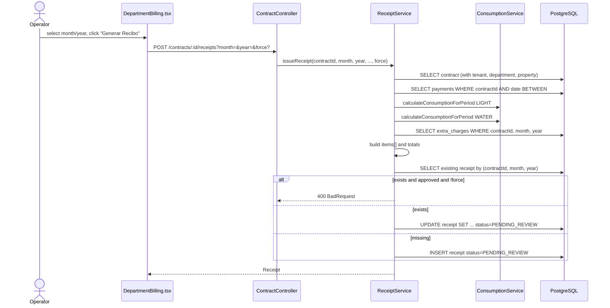

---

## 3.13 Contract Settlement

### Purpose
Read-only forecast: given a contract and an `actualEndDate`, compute total charges, payments, and final balance — used by the operator to preview a checkout.

### Main Responsibilities
- Walk monthly through `contract.startDate → effectiveEndDate`, summing `rentAmount` each iteration.
- Sum all payments ever attached to the contract.
- If `actualEndDate > contract.endDate`, compute `daysOverstayed * (rent/30)`, capped at `guaranteeDeposit`, as a `guaranteeDeduction` added to charges.
- `finalBalance = totalPayments - totalCharges` (positive ⇒ landlord owes refund; negative ⇒ tenant owes).

### Key File
`apps/api/src/contract-settlement/contract-settlement.service.ts`

### Business Rules
- The monthly walk uses `currentMonth.setMonth(currentMonth.getMonth() + 1)`. On months with fewer days (Jan 31 → setMonth(+1) → Mar 3), JS Date will roll over. **This means a contract starting Jan 31 over-counts February.** Real-world risk is low because rent is monthly, but be aware.
- The result is *not persisted*. It is a recompute every call.

### Edge Cases
- `actualEndDate < contract.endDate` (early termination) → `effectiveEndDate = contract.endDate`, so the tenant is still billed up to the original end date. This is intentional for fee-bearing early-termination scenarios.
- The `advancePaymentUsed` boolean is currently always `false` (`const advancePaymentUsed = false;`). Likely a stub.

### Technical Debt / Risks
- The settlement endpoint and the termination endpoint compute related-but-different numbers. This is confusing for users.
- The settlement does **not** include utility costs (water, light) or extra charges — only rent + guarantee deduction. The actual final bill therefore differs from the settlement preview by the cost of unbilled utilities and any open extra charges.

---

## 3.14 Contract Termination

### Purpose
Finalize a contract: record actual departure, compute services-vs-deposit math, freeze a snapshot, mark the contract `TERMINATED`, and free the department.

### Main Responsibilities
- `terminate(contractId, dto)`:
  - Validate contract exists and is not already terminated (`ConflictException` if so).
  - Pull `advancePayment`, `guaranteeDeposit` from the contract.
  - Compute `rentRefundRaw = max(0, rentAmount - proratedRentAmount)` if the tenant left mid-month and rent was prorated.
  - Apply `servicesCost` against the refund first; any remainder reduces the guarantee.
  - `guaranteeReturn = max(0, guaranteeDeposit - guaranteeDeduction - servicesFromGuarantee)`.
  - Insert a `contract_termination` row.
  - `UPDATE contract.status = TERMINATED`.
  - `UPDATE department.isAvailable = true`.
- `findByContract(contractId)` returns the snapshot or `null`.

### Math Diagram

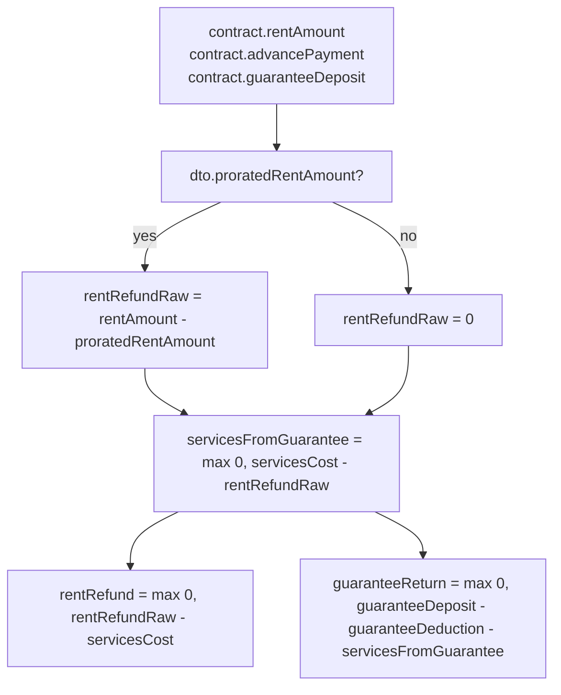

### Business Rules
- `expectedDepartureDate` is taken from `contract.endDate` (the snapshot freezes the *original* end date).
- `actualDepartureDate` is the date the tenant actually left.
- `guaranteeDeduction` is operator-entered (penalties, damages).
- `servicesCost` is operator-entered. The frontend (`DepartmentBilling.tsx`) computes it as `lightCost + waterCost + extraTotal` from the *current* receipt preview.
- After termination, the contract is locked; calling `terminate` again throws `409 Conflict`.

### Edge Cases
- Contract already terminated → `409 Conflict`.
- Negative inputs blocked by `class-validator` `@Min(0)`.
- The `expectedDepartureDate` is converted from `Date` to `YYYY-MM-DD` string using `.toISOString().substring(0, 10)` — this is **UTC**, which can drift one day off the local date in extreme timezones. (Past bug: "contract-termination: fix date serialization and add DTO validation" — see commit `02e983b`.)

### Failure Scenarios
- Three sequential writes (`INSERT termination`, `UPDATE contract.status`, `UPDATE department.isAvailable`) are **not wrapped in a transaction**. A crash between step 1 and step 2 would leave the termination saved but the contract still ACTIVE. The operator would see "ya terminado" inconsistently across pages.

### Observability
- No logs.

### Technical Debt / Risks
- The math is subtle (services consume refund before they consume guarantee) and not covered by tests in this repo.
- Missing transactional boundary.

---

## 3.15 Seed Bootstrap

### Purpose
On first boot, create an admin account from `ADMIN_EMAIL`/`ADMIN_PASSWORD` env vars so the system has at least one user who can approve registrations.

### Key File
`apps/api/src/seed/seed.service.ts`

### Behavior
- Runs in `OnModuleInit`.
- If either env var is missing → logs a warning and skips.
- If an admin already exists (`findAdmin`) → logs and skips.
- Else → creates `{ email, passwordHash: bcrypt(password), role: 'admin', status: 'approved' }`.

### Edge Cases
- The seed only checks for **any** admin; if the seeded admin's password was rotated in `.env` after first boot, the seed is a no-op.

---

## 3.16 Frontend Shell

### Purpose
The React 19 SPA provides the operator-facing UI: auth, sidebar navigation, dashboard, and per-domain pages.

### Routes

| Path | Page | Auth |
| :-- | :-- | :-- |
| `/login` | `Login.tsx` | public |
| `/register` | `Register.tsx` | public |
| `/` | `Dashboard.tsx` | protected |
| `/properties` | `Properties.tsx` | protected |
| `/properties/:id` | `PropertyDetail.tsx` | protected |
| `/departments` | `Departments.tsx` | protected |
| `/departments/:id` | `DepartmentDashboard.tsx` | protected |
| `/departments/:id/billing` | `DepartmentBilling.tsx` | protected |
| `/tenants` | `Tenants.tsx` | protected |
| `/tenants/:id` | `TenantDashboard.tsx` | protected |
| `/contracts` | `Contracts.tsx` | protected |
| `/meters` | `Meters.tsx` | protected |
| `/readings` | `MeterReadings.tsx` | protected |
| `/payments` | `Payments.tsx` | protected |
| `/admin/users` | `admin/AdminUsers.tsx` | protected + admin |

### Layout

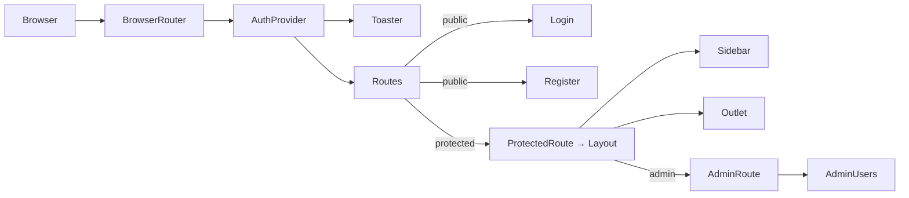

### Key Patterns

- **Auth bootstrap.** `AuthContext` calls `silentRefresh()` once on mount. While `isLoading`, `ProtectedRoute` renders a `<Spinner>`. This avoids a flash of `/login` for users with valid refresh cookies.
- **API client interceptor.** `lib/api.ts` intercepts `401`s and replays the request with a fresh token after a single refresh attempt.
- **Toast notifications.** Every mutation produces a success/error toast via `showSuccess` / `showError`.
- **Skeleton loaders.** `components/Skeleton.tsx` provides `DashboardSkeleton`, `PageSkeleton`, etc., shown while pages fetch.
- **Per-page state.** Each page owns its own `useState` + `useEffect`. The largest pages (`DepartmentBilling.tsx`, `PropertyDetail.tsx`, `DepartmentDashboard.tsx`) host 10-30 state variables each.

### Receipt UI Flow (DepartmentBilling)

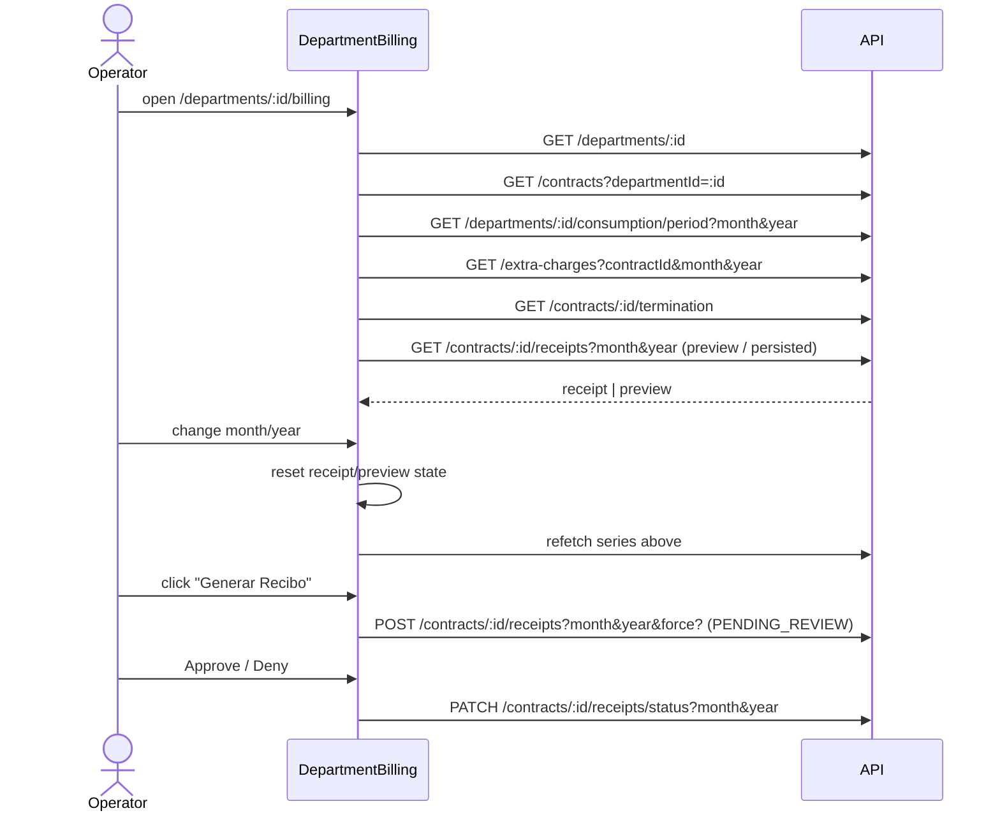

---

# 4. Cross-Module Relationships

## 4.1 Dependency Graph

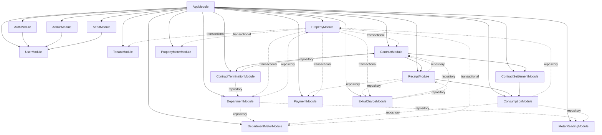

## 4.2 Tight Coupling Notes

- **Contract is the aggregate root for billing.** Receipts, payments, extra charges, settlements, and terminations all reference `contractId`. Changes to the Contract entity (status enum additions, field renames) ripple through 6+ services.
- **Receipt depends on Contract, Payment, ExtraCharge, Consumption.** The most fan-in service. A bug here breaks the whole billing UX.
- **Property's hand-rolled cascade** reaches into 7 other tables, making `PropertyModule` the most data-coupled module in the system.
- **`SeedModule → UserModule`** is the only non-feature module-to-module dependency that triggers on boot.

## 4.3 Circular Dependency Risks

None observed at the module-import level. `ExtraChargeModule` and `ReceiptModule` share a 1-way edge (`ExtraCharge.sourceReceiptId → receipt_entity.id`), but it is data-level, not code-level. `ReceiptService` does not import `ExtraChargeService`; it uses the `ExtraCharge` repository directly. This is the more sustainable choice.

## 4.4 Transaction Boundaries

| Operation | Boundary | Risk |
| :-- | :-- | :-- |
| `PropertyService.remove` | ✅ Transactional (`dataSource.transaction`) | Low. Atomic. |
| `ContractService.create` (insert contract + flip department.isAvailable) | ❌ Not transactional | Medium — orphan state on partial failure. |
| `ContractTerminationService.terminate` (insert termination + flip status + flip availability) | ❌ Not transactional | Medium — inconsistent state on partial failure. |
| `DepartmentService.create` (department + initial meter + initial reading) | ❌ Not transactional | Low (loose ends only on the meter/reading rows). |
| `ReceiptService.issueReceipt` | ❌ Not transactional (single save) | Low — single row. Race: two concurrent issues could violate unique constraint with a 500. |
| `ExtraChargeService.generateLateFee` | ❌ Not transactional | Low — idempotent upsert pattern. |

## 4.5 Event Propagation

The system does not emit domain events. State changes are local to the calling service. A change in receipt status, for example, does **not** notify the tenant, the dashboard, or any subscriber. Each frontend page either polls on load or refetches after a mutation.

## 4.6 Ownership Boundaries

| Concern | Owner |
| :-- | :-- |
| User identity & approval | `UserModule` + `AuthModule` + `AdminModule` |
| Physical inventory | `PropertyModule` + `DepartmentModule` |
| Real-world humans | `TenantModule` |
| Rental relationship | `ContractModule` |
| Metering | `DepartmentMeterModule` + `MeterReadingModule` + `ConsumptionModule` |
| Money in | `PaymentModule` |
| Money out / one-off | `ExtraChargeModule` |
| Monthly bill | `ReceiptModule` |
| Closure forecast | `ContractSettlementModule` |
| Closure execution | `ContractTerminationModule` |

---

# 5. Data Model Overview

## 5.1 ERD

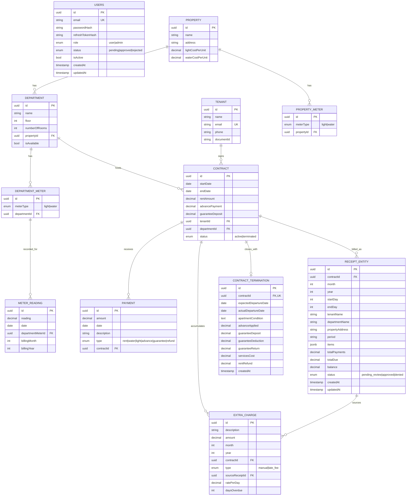

## 5.2 Aggregate Roots

| Aggregate Root | Members |
| :-- | :-- |
| **Property** | Property, Department, DepartmentMeter, MeterReading, PropertyMeter |
| **Contract** | Contract, Payment, ExtraCharge, ReceiptEntity, ContractTermination |
| **User** | User (alone) |
| **Tenant** | Tenant (alone — but lifecycle is coupled to Property cleanup) |

## 5.3 Cardinality Notes

- One `Property` → many `Department`s → many `Contract`s (sequential, not concurrent).
- One `Department` → 0-2 `DepartmentMeter`s (one LIGHT, one WATER).
- One `DepartmentMeter` → many `MeterReading`s (ordered by date).
- One `Contract` → at most one `ContractTermination` (`@Unique on contractId`).
- One `Contract` → at most one `ReceiptEntity` per `(month, year)` (`uq_receipt_contract_period`).
- One `Tenant` → many `Contract`s (over time, possibly across properties).

## 5.4 Lifecycle / Soft Deletes / Audit

- **No soft deletes.** All `DELETE` operations are hard.
- **No audit log table.** Status changes (receipt approval, user approval, contract termination) overwrite in place. The only "audit" is `createdAt`/`updatedAt` on entities that declare them (User, ReceiptEntity, ContractTermination).
- **No optimistic locking** (no `version` columns). Two writers can clobber each other silently.

## 5.5 Caching Strategy

None. Every read goes to PostgreSQL.

---

# 6. API Documentation Overview

## 6.1 Authentication

- **Bearer JWT** in the `Authorization` header for everything except `@Public()` routes.
- **httpOnly cookie** named `refreshToken` for refresh.
- All requests run through the global `ValidationPipe`, which coerces and strips fields based on the route's DTO.

## 6.2 Public Routes

| Method | Path | Body / Query | Notes |
| :-- | :-- | :-- | :-- |
| POST | `/auth/register` | `{ email, password (min 8) }` | Returns `{ message: "Account pending approval" }`. Always 200. Conflict if email taken. |
| POST | `/auth/login` | `{ email, password }` | 200 → `{ accessToken }` + cookie. 401 invalid creds. 403 if pending/rejected. |
| POST | `/auth/refresh` | (cookie) | 200 → `{ accessToken }` + rotated cookie. 401 if cookie missing/invalid/mismatched. |

## 6.3 Authenticated Routes

| Method | Path | Purpose |
| :-- | :-- | :-- |
| POST | `/auth/logout` | Clears refresh cookie, nulls `refreshTokenHash`. 204. |
| GET | `/auth/me` | Returns the JWT payload. |
| GET/POST/PATCH/DELETE | `/properties` `/properties/:id` | CRUD. |
| GET | `/properties/:id/tenants` | Distinct tenants who ever contracted on this property. |
| GET | `/properties/:id/departments` | Departments scoped to this property. |
| GET/POST/PATCH/DELETE | `/departments` `/departments/:id` | CRUD. |
| GET | `/departments/:id/consumption` | Latest-two-readings consumption per meter type. |
| GET | `/departments/:id/consumption/period?month&year` | Billing-period-scoped consumption per meter type. |
| GET/POST/PATCH/DELETE | `/tenants` `/tenants/:id` | CRUD. |
| GET | `/contracts?tenantId=&departmentId=` | Filtered listing. |
| POST/PATCH/DELETE | `/contracts` `/contracts/:id` | CRUD. |
| GET | `/contracts/receipts/pending` | All `PENDING_REVIEW` receipts sorted year-desc, month-desc. |
| GET | `/contracts/:id/receipts?month&year&startDay?&endDay?&prorateRent?` | Preview (persisted if exists, else computed). |
| POST | `/contracts/:id/receipts?month&year&...&force?` | Issue/regenerate. |
| PATCH | `/contracts/:id/receipts/status?month&year` | `{ status: 'approved' | 'denied' | 'pending_review' }`. |
| GET | `/contracts/:id/settlement?actualEndDate=YYYY-MM-DD` | Read-only forecast. |
| GET | `/contracts/:id/termination` | Existing termination snapshot or `null`. |
| POST | `/contracts/:id/termination` | Finalize: `{ actualDepartureDate, apartmentCondition?, guaranteeDeduction, servicesCost?, proratedRentAmount? }`. |
| GET/POST/PATCH/DELETE | `/department-meters` `/department-meters/:id` | CRUD. |
| GET/POST/PATCH/DELETE | `/property-meters` `/property-meters/:id` | CRUD (currently unused by billing). |
| GET/POST/PATCH/DELETE | `/meter-readings` `/meter-readings/:id` | CRUD. |
| GET | `/extra-charges?contractId&month&year` | Filtered listing. |
| POST | `/extra-charges` | Create manual charge. |
| POST | `/extra-charges/late-fee` | Generate or update an auto late fee. |
| DELETE | `/extra-charges/:id` | Delete (rejects `LATE_FEE`). |
| GET | `/payments?contractId?` | List, optionally scoped. |
| POST/PATCH/DELETE | `/payments` `/payments/:id` | CRUD. |

## 6.4 Admin Routes (requires `role=admin`)

| Method | Path | Purpose |
| :-- | :-- | :-- |
| GET | `/admin/users` | Non-admin user list with status. |
| PATCH | `/admin/users/:id/approve` | Approve. |
| PATCH | `/admin/users/:id/reject` | Reject. |

## 6.5 Validation & Errors

- DTOs annotated with `class-validator` decorators (`IsEmail`, `IsUUID`, `IsDateString`, `IsEnum`, `Min`, `Max`, `IsOptional`).
- Global `ValidationPipe({ whitelist: true, transform: true })` strips unknown fields and coerces strings into the declared types.
- Error response shape is the NestJS default: `{ statusCode, message, error }`. The frontend extracts `message` from the response body for toasts.
- HTTP semantics:
  - `400` — validation, missing entity reference (used as `BadRequestException` in many services).
  - `401` — bad/missing token.
  - `403` — wrong role (admin routes), pending/rejected account.
  - `404` — not found.
  - `409` — terminated contract / duplicate registration.
  - `500` — uncaught (e.g. DB constraint violation not wrapped).

## 6.6 Pagination, Rate Limiting, Versioning

- **No pagination.** Every list endpoint returns the full table. Acceptable for small deployments; scales linearly.
- **No rate limiting.**
- **No API versioning.** The frontend talks to whatever the API is today. Breaking changes require coordinated deploys.

## 6.7 Example Request/Response — Issue Receipt

Request:
```http
POST /contracts/3f6e…/receipts?month=4&year=2026&startDay=1&endDay=15&prorateRent=true HTTP/1.1
Authorization: Bearer eyJhbGciOi...
```

Response:
```json
{
  "id": "5a8c…",
  "contractId": "3f6e…",
  "month": 4,
  "year": 2026,
  "startDay": 1,
  "endDay": 15,
  "status": "pending_review",
  "tenantName": "Juan Pérez",
  "departmentName": "Depto 201",
  "propertyAddress": "Av. Arequipa 1234, Lima",
  "period": "1–15 April 2026",
  "items": [
    { "description": "Monthly Rent (15/30 days)", "amount": 500.00 },
    { "description": "Electricity Consumption (42 units)", "amount": 10.50 },
    { "description": "Water Consumption (8 units)", "amount": 1.20 },
    { "description": "Otros: Limpieza", "amount": 30.00 },
    { "description": "Payment (rent) - Mar 28 transfer", "amount": -300.00 }
  ],
  "totalPayments": 300.00,
  "totalDue": 541.70,
  "balance": -241.70
}
```

Negative `balance` ⇒ tenant owes.

---

# 7. Infrastructure & Deployment

## 7.1 Local Development

- **Database.** `docker-compose up -d` boots PostgreSQL 15 on `localhost:5432` (DB `property_management`, user `user`, password `password`). Volume `postgres_data` persists data.
- **Backend.** `cd apps/api && npm run dev` (NestJS watch mode). Listens on `:3001`.
- **Frontend.** `cd apps/client && npm run dev` (Vite). Serves on `:5173`.
- **Monorepo.** From the root: `npm run dev` (Turborepo runs both in parallel).
- **Env file.** `apps/api/.env` provides JWT secrets and the admin seed credentials:
  - `JWT_ACCESS_SECRET`, `JWT_REFRESH_SECRET`
  - `JWT_ACCESS_EXPIRES_IN=15m`, `JWT_REFRESH_EXPIRES_IN=7d`
  - `ADMIN_EMAIL`, `ADMIN_PASSWORD`

## 7.2 CI/CD

**There is no CI/CD configuration** in the repo. No GitHub Actions, no Dockerfile for the apps, no production build script. Husky + commitlint enforce Conventional Commits locally, but that's a pre-commit hook, not CI.

## 7.3 Environments

- Implicitly two: developer laptop and (currently nonexistent) production.
- CORS hardcodes `http://localhost:5173`. Frontend `API_BASE` hardcodes `http://localhost:3001`.

## 7.4 Secrets Management

- All secrets in `.env` (committed-looking — verify `.gitignore` includes `.env`).
- No vault, no secret manager.

## 7.5 Scaling Strategy

- The monolith is stateless except for the bcrypt-hashed refresh tokens in PostgreSQL, so the API itself is horizontally scalable behind any load balancer.
- The DB is the single bottleneck; vertical scaling is straightforward, sharding is not designed for.

## 7.6 Caching, CDN, Background Jobs

- **No caching.**
- **No CDN.** Vite produces a static bundle that would naturally sit behind a CDN, but there is no deployment artifact for that.
- **No background jobs.** Late fees are operator-triggered.

## 7.7 Deployment Diagram (proposed)

```mermaid
graph LR
    User((User)) -- HTTPS --> CDN[Static CDN<br/>(apps/client dist)]
    User -- HTTPS --> LB[Load Balancer]
    LB --> API1[NestJS instance 1]
    LB --> API2[NestJS instance 2]
    API1 & API2 --> PG[(Managed PostgreSQL)]
    Admin -- SSH --> Bastion --> PG
```

---

# 8. Security Architecture

## 8.1 Authentication & Tokens

- **Access tokens** are JWTs signed with HS256 (default for `@nestjs/jwt`) using `JWT_ACCESS_SECRET`. Payload: `{ sub, email, role }`. Expiry 15m.
- **Refresh tokens** are JWTs signed with `JWT_REFRESH_SECRET`. Stored in an `httpOnly`, `sameSite=lax`, `path=/`, 7d-maxAge cookie. The server stores a bcrypt hash of the **active** refresh token in `users.refresh_token_hash` so that on rotation, the old token's hash no longer matches.
- **Rotation.** Every successful refresh issues a new refresh token and overwrites the hash; old refresh tokens become invalid immediately.

## 8.2 Authorization

- Global `JwtGuard` blocks unauthenticated requests; routes opt out with `@Public()`.
- `RolesGuard` (admin only) reads metadata set by `@Roles('admin')`.
- **No row-level security.** Any authenticated user can read/write any property/department/tenant/contract. The system assumes a single landlord.

## 8.3 Session Management

- Stateless JWT for access; stateful (hashed) refresh allows server-side revocation via logout.
- No "concurrent device" tracking — the latest refresh wins, prior devices get 401s.

## 8.4 Input Validation

- `class-validator` decorators at every DTO boundary.
- `ValidationPipe({ whitelist: true })` strips fields the DTO doesn't declare → mitigates mass-assignment.
- `transform: true` lets `@Type(() => Number)` coerce decimal-looking strings (used in `CreateContractTerminationDto`).

## 8.5 Encryption

- Passwords: bcrypt cost 10.
- Refresh tokens: bcrypt cost 10 (hashed at rest).
- No envelope encryption for any field. Tenant `email`/`documentId` are stored in plaintext (acceptable; they are operational data, not credentials).

## 8.6 OWASP Top-10 Posture

| Risk | Status |
| :-- | :-- |
| A01 Broken Access Control | ⚠️ Single-tenant assumption; no per-resource ACLs. |
| A02 Cryptographic Failures | ⚠️ Cookies not `secure`; OK in dev, fix for prod. |
| A03 Injection | ✅ Parameterized via TypeORM; no `query()` with concatenation. |
| A04 Insecure Design | ⚠️ No rate limiting on auth endpoints; no MFA. |
| A05 Security Misconfiguration | ⚠️ Hardcoded DB creds in source; `synchronize: true`. |
| A06 Vulnerable Components | Not audited; deps are recent (`@nestjs/*` v11, React 19). |
| A07 Auth Failures | ⚠️ No login throttling; password complexity is only `min 8`. |
| A08 Software & Data Integrity Failures | ✅ DTO whitelisting; refresh rotation. |
| A09 Logging Failures | ⚠️ Almost no auth/audit logging. |
| A10 SSRF | N/A (no outbound requests). |

## 8.7 CSRF/XSS

- **CSRF.** The refresh cookie is `sameSite=lax`, which mitigates cross-site POSTs. Access tokens travel in headers (not cookies) so CSRF is largely moot for those. Acceptable.
- **XSS.** React escapes by default. There is no `dangerouslyInnerHTML` in the read code. The access token lives in JS memory and is **erased on reload**, limiting blast radius if XSS were ever introduced (refresh cookie is httpOnly).

---

# 9. Performance Considerations

## 9.1 Hot Paths

- **DepartmentBilling page load** fires 5 parallel requests (department, contracts, consumption, extra-charges, termination), then 1 sequential receipt preview. Each request is independent so latency is `max(5) + 1`. Each is one DB query (or a few JOINs).
- **Dashboard** fires 5 parallel requests to count rows. Each is `SELECT *` without aggregation — this fetches the full table. For 5-figure row counts, it would be noticeable. Use `SELECT count(*)` instead.

## 9.2 Known Performance Issues

| Issue | Severity | Notes |
| :-- | :-- | :-- |
| Dashboard counts via `SELECT *` from 5 tables | Medium | Will scale poorly past ~10k rows in any table. |
| `findAll` returns entire tables with `relations` | Medium | TypeORM defaults to per-row joins; N+1-style. Property and department listings would suffer at scale. |
| Receipt regeneration re-runs all sub-queries each call | Low | Acceptable; the operator triggers it manually. |
| `findPendingReceipts` orders by `(year DESC, month DESC)` without an index | Low | A composite index would help once receipts grow. |
| `ConsumptionService` runs 2 separate query-builder lookups for current and previous readings | Low | Could be a single windowed query. |

## 9.3 DB Indexing

- TypeORM only auto-creates indexes for `@PrimaryGeneratedColumn`, `@Unique`, and FKs. Real-world hot queries on `receipt_entity (contractId, month, year)` are already backed by `uq_receipt_contract_period`. `meter_reading (departmentMeterId, date DESC)` should have a composite index — currently relies on the PK only.

## 9.4 Concurrency

- No locks. Two concurrent `issueReceipt` calls for the same `(contractId, month, year)` will race; the second insertion fails on the unique constraint and surfaces a 500.
- No optimistic locking on `Receipt` or `Contract` — last-write-wins on PATCH.

---

# 10. Testing Strategy

## 10.1 Test Suites Present

| File | Coverage |
| :-- | :-- |
| `apps/api/src/app.controller.spec.ts` | Smoke test of root controller. |
| `apps/api/src/tenant/tenant.service.spec.ts` | Tenant service unit tests. |
| `apps/api/src/contract/contract.service.spec.ts` | Contract CRUD and validation. |
| `apps/api/src/contract/contract.overlap.spec.ts` | Specifically tests department availability check. |
| `apps/api/src/property/property.controller.spec.ts` | Controller integration with mocked services. |
| `apps/api/src/property/property.service.spec.ts` | Property service. |
| `apps/api/src/payment/payment.service.spec.ts` | Payment service. |
| `apps/api/src/receipt/receipt.service.spec.ts` | Receipt issuance logic. |

All backend tests are **unit tests with mocked repositories** (`getRepositoryToken(Entity)` + jest.fn factories). There are **no integration tests against a real DB**. There is an `apps/api/test/` folder with placeholder e2e setup, but no specs to run against it.

## 10.2 Frontend Testing

**None.** No test runner is installed in `apps/client/package.json`.

## 10.3 Test Gaps

- **No e2e** covering the auth approval → contract → receipt → late-fee → termination flow (the primary business workflow).
- **No tests** for `ConsumptionService` period vs billing-period modes — the most algorithmically subtle code in the project.
- **No tests** for `ContractTerminationService` math (services-vs-deposit precedence, refunds).
- **No tests** for `ExtraChargeService.generateLateFee` (date arithmetic, upsert logic).
- **No tests** for `AuthService` (login gating, refresh rotation).

## 10.4 Flaky Areas

- Any test that depends on `new Date()` is sensitive to local TZ. `MeterReadingService.deriveBillingPeriod` and `ExtraChargeService.generateLateFee` both use `new Date()` and `getMonth()/getDate()` in ways that could behave differently in CI.

---

# 11. Known Risks & Technical Debt

## 11.1 High Priority

1. **`synchronize: true` and hardcoded DB credentials in `app.module.ts`.** Production cannot start safely. Any entity rename rewrites the table.
2. **No transactions on multi-write operations** (Contract create, Contract termination, Department create with initial readings). Partial-failure inconsistency.
3. **No tenant scoping / org model.** A second operator joining the system has full read/write on the first operator's data.
4. **No rate limiting** on `/auth/login` or `/auth/refresh`. Credential stuffing risk.
5. **Cookies not `secure`** in production config.
6. **Refresh-token rotation per device is single-active.** Two tabs / two phones produce constant 401s and re-logins. UX bug at scale.

## 11.2 Medium Priority

7. **Massive page components** (`DepartmentBilling.tsx` ~1.2k LOC, `PropertyDetail.tsx` ~1.5k LOC, `DepartmentDashboard.tsx` ~940 LOC). Mix data fetching, business rules, and UI. High change-amplification.
8. **No domain events / no notifications.** Approving a receipt or a user does nothing visible to other actors. Future "send to WhatsApp" is stubbed (`handleSendWhatsApp` is a literal `alert(...)`).
9. **Hardcoded business constants** scattered across services: grace period of 15 days for late fees, default rates `0.25` / `0.15`, frontend defaults `5.00/day`. Should be DB-backed config.
10. **Dashboard counts via full-table reads** (`SELECT *` then `.length`).
11. **Negative-consumption hide** (returning 0) is silently lossy — a real reading swap (e.g. broken meter replaced) appears to bill nothing without raising a flag in the UI.
12. **`new Date(year, month, …)` arithmetic** with 1-indexed month inputs is fragile (off-by-one risk). Documented mostly via tests of `contract.overlap.spec.ts` but the late-fee deadline math depends on it too.
13. **No structured logging** anywhere except `MeterReadingService` and `ExtraChargeService`.
14. **No audit trail** for: user approvals/rejections, receipt approvals, terminations, status changes.

## 11.3 Low Priority

15. **`PropertyMeter` is dead code.** Defined and CRUDable but never read.
16. **`advancePaymentUsed: false` constant** in `ContractSettlementService` — likely an incomplete feature.
17. **`SeedService` only seeds an admin once**; rotating `ADMIN_PASSWORD` in `.env` has no effect after first boot.
18. **No frontend test coverage.**
19. **No API versioning** (`/v1`, `/v2`).
20. **Currency is hardcoded to `S/`** in late-fee descriptions; not localized.

---

# 12. Suggested Improvements

## 12.1 Architecture

- Replace `synchronize: true` with proper migrations (TypeORM migrations or, ideally, switch to a tool like Drizzle/Prisma that integrates with CI).
- Externalize DB connection via `DATABASE_URL`.
- Introduce an `Organization` (tenant) row and a junction `OrganizationUser`; scope every query by `organizationId`. This is the only way to safely host more than one landlord on the same instance.
- Wrap multi-write operations in `dataSource.transaction(...)`.
- Add Conventional-Commits-driven release workflow (Changesets or semantic-release).

## 12.2 Refactors

- Break `DepartmentBilling.tsx` and `PropertyDetail.tsx` into 5-10 sub-components each, with a `useDepartmentBilling` hook owning data fetching.
- Introduce a small `useFetch`/`useQuery` abstraction (or actually adopt TanStack Query) so every page doesn't re-implement loading/error/refetch.
- Move billing constants (`COST_PER_UNIT_LIGHT`, `0.15`, grace days `15`) into the `Property` entity or a `BillingConfig` table.
- Replace late-fee period calculation with a Date helper that explicitly accepts a config object.

## 12.3 Observability

- Adopt `pino` or NestJS `Logger` with JSON output. Log: every auth attempt (success/fail, sanitized), every receipt issue/approve/deny, every termination, every property delete.
- Add an `AuditLog` table written by an interceptor on the relevant mutation endpoints.
- Send key business events to a metric bus (Prometheus or OpenTelemetry).

## 12.4 Testing

- Add an e2e harness with a real Dockerized Postgres (per `platform-testing` skill guidance) and cover the four critical flows: auth approval, contract creation, receipt issuance with proration, contract termination.
- Add unit tests for `ConsumptionService` period mode, `ExtraChargeService.generateLateFee`, `ContractTerminationService.terminate` math, and `ReceiptService` proration.
- Add frontend tests with Vitest + Testing Library for `Login`, `DepartmentBilling` happy path.

## 12.5 Security

- Add `express-rate-limit` (or `@nestjs/throttler`) on `/auth/login` and `/auth/refresh`.
- Set cookies to `secure: process.env.NODE_ENV === 'production'` and `sameSite: 'strict'` where compatible.
- Audit-log every admin user approve/reject with `{ actor, target, decision, timestamp }`.
- Require password complexity beyond `min 8` (zxcvbn score 3+, or NIST 800-63B).

## 12.6 Performance

- Replace dashboard counts with `SELECT count(*)` per table or a single aggregate query.
- Add composite index on `meter_reading (department_meter_id, date DESC)`.
- Add index on `receipt_entity (status, year DESC, month DESC)` to back the pending-receipts list.

---

# 13. Developer Onboarding Guide

## 13.1 Prerequisites

- Node 20+, npm 10+
- Docker + Docker Compose (for the local DB)
- A POSIX shell (zsh/bash) — Husky hooks call `npx`

## 13.2 First-Time Setup

```bash
# 1. Clone & install
git clone <repo>
cd project-t
npm install

# 2. Start PostgreSQL
docker-compose up -d
# Verify it is healthy on localhost:5432

# 3. Configure backend env
cat > apps/api/.env <<EOF
JWT_ACCESS_SECRET=change-this-in-production-min-32-chars
JWT_REFRESH_SECRET=change-this-refresh-secret-min-32-chars
JWT_ACCESS_EXPIRES_IN=15m
JWT_REFRESH_EXPIRES_IN=7d
ADMIN_EMAIL=admin@propmanager.local
ADMIN_PASSWORD=changeme123
EOF

# 4. Run everything
npm run dev
# API:  http://localhost:3001
# SPA:  http://localhost:5173

# 5. Log in
# Use the seeded admin credentials above.
```

## 13.3 Important Folders

```
project-t/
├─ apps/
│  ├─ api/                      ← NestJS backend
│  │  └─ src/
│  │     ├─ app.module.ts       ← Top-level module wiring + DB config
│  │     ├─ main.ts             ← Bootstrap (CORS, ValidationPipe, cookieParser)
│  │     ├─ auth/               ← Auth module (guards, JWT)
│  │     ├─ user/               ← User entity + service
│  │     ├─ admin/              ← Admin user-approval routes
│  │     ├─ seed/               ← OnModuleInit admin seed
│  │     ├─ property/           ← Property + cascading delete
│  │     ├─ department/         ← Departments + initial readings
│  │     ├─ tenant/             ← Tenants (real people)
│  │     ├─ contract/           ← Contracts + nested receipt/settle/term routes
│  │     ├─ department-meter/   ← Per-unit meter records
│  │     ├─ property-meter/     ← (Currently unused) building meters
│  │     ├─ meter-reading/      ← Readings + billing-period derivation
│  │     ├─ consumption/        ← Calculation service for utilities
│  │     ├─ payment/            ← Tenant payment ledger
│  │     ├─ extra-charge/       ← Manual & auto late-fee charges
│  │     ├─ receipt/            ← Monthly billing aggregate
│  │     ├─ contract-settlement/← Read-only checkout forecast
│  │     └─ contract-termination/ ← Final closure with snapshot
│  └─ client/                   ← React 19 SPA
│     └─ src/
│        ├─ App.tsx             ← Route map
│        ├─ main.tsx            ← React DOM root
│        ├─ contexts/AuthContext.tsx
│        ├─ components/         ← Layout, Sidebar, Modal, DatePicker, Skeleton
│        ├─ hooks/useTheme.ts   ← Dark-mode toggle
│        ├─ lib/{api,styles,toast,utils}.ts
│        └─ pages/              ← One file per route, plus admin/AdminUsers.tsx
├─ packages/
│  ├─ ui/                       ← Empty placeholder package
│  ├─ eslint-config/            ← Shared ESLint config
│  └─ typescript-config/        ← Shared tsconfig
├─ .planning/                   ← Project documents (PROJECT, ROADMAP, phase plans)
├─ docker-compose.yml
├─ turbo.json
└─ CLAUDE.md / AGENTS.md        ← Working-with-Claude instructions
```

## 13.4 Recommended Reading Order

1. `CLAUDE.md` — operational notes (where the rules are, how to run the project, etc.).
2. `apps/api/src/app.module.ts` — see every feature module wired.
3. `apps/api/src/auth/` and `apps/api/src/user/` — understand the JWT + approval lifecycle.
4. `apps/api/src/contract/` — the aggregate root; everything billing-related funnels through here.
5. `apps/api/src/receipt/receipt.service.ts` — the most business-logic-dense file.
6. `apps/api/src/consumption/consumption.service.ts` — period vs latest math.
7. `apps/api/src/contract-termination/contract-termination.service.ts` — closure math.
8. `apps/client/src/App.tsx` and `apps/client/src/contexts/AuthContext.tsx` — frontend wiring.
9. `apps/client/src/pages/DepartmentBilling.tsx` — primary operator workflow.

## 13.5 Debugging Tips

- **Auth failures** are silent in the API. Add a temporary `console.log` in `JwtGuard.canActivate` to see why a request is being rejected.
- **TypeORM hot reloads (`synchronize: true`)** drop columns on rename. If columns vanish unexpectedly, suspect an entity rename. Drop the volume and restart: `docker-compose down -v && docker-compose up -d`.
- **Receipt math seems off?** Trace: `/contracts/:id/receipts?month=&year=` returns the preview computed live. Compare its `items[]` with the DB directly — `SELECT items, total_due, balance FROM receipt_entity WHERE contract_id=...`.
- **Refresh loop in browser:** check that `/auth/refresh` returns 200 in the Network tab. If 401, the `refreshTokenHash` is mismatched — log in again to rotate.
- **CORS error in console:** the frontend dev port must be `5173` (Vite default). Anything else is rejected by the API's CORS.

## 13.6 Common Pitfalls

| Pitfall | Mitigation |
| :-- | :-- |
| Forgot to `docker-compose up` before starting API | `pg_connect` errors on boot. |
| Browser still has stale refresh cookie after schema reset | Hard-refresh and clear cookies for localhost. |
| Adding a column to an entity but the DB has stale data of a previous schema | Drop the volume: `docker-compose down -v`. |
| Using 0-indexed month in frontend, 1-indexed in API | Convert at the API call site. `new Date().getMonth() + 1`. |
| Creating a new module but forgetting to register it in `app.module.ts` | TypeORM `autoLoadEntities: true` won't pick up entities that aren't imported through a registered module. |

---

# 14. Glossary

| Term | Meaning |
| :-- | :-- |
| **Property** | A building owned/managed by the operator. Has many departments. |
| **Department** | One rental unit (apartment, studio, room). Belongs to one property. May be available or rented. |
| **Tenant** | The real human renting a department. Not a system user. |
| **Contract** | The agreement binding a tenant to a department for a date range. Carries rent, advance, and guarantee. |
| **Advance Payment** | One month's rent paid upfront, refundable on termination (less any deductions). |
| **Guarantee / Guarantee Deposit** | The security deposit. Refundable minus damages (`guaranteeDeduction`) and any unbilled services. |
| **Meter** | Physical utility meter — water or electricity. Tied to a department (`DepartmentMeter`). |
| **Meter Reading** | Single timestamped value of a meter, with an explicit or derived billing period. |
| **Billing Period** | The (month, year) tuple a meter reading is attributed to. A day-1-of-month reading is attributed to the *previous* month. |
| **Consumption** | `currentReading - previousReading` for a meter inside a billing period. Negative values are clamped to zero. |
| **Receipt** | The monthly bill for a contract: rent + utilities + extras − payments → balance. Status moves through `pending_review → approved | denied`. |
| **Pending Review** | Receipt status — issued but not yet approved by the operator. |
| **Approved** | Receipt status — operator has confirmed the figures. Cannot be regenerated without `force=true`. |
| **Denied** | Receipt status — operator rejected; can be reissued (regeneration resets it to `pending_review`). |
| **Extra Charge** | Ad-hoc line item on a period: cable, cleaning, late fees. |
| **Late Fee (`LATE_FEE`)** | Auto-generated extra charge created via `POST /extra-charges/late-fee`. Cannot be deleted manually. Amount = `daysOverdue × ratePerDay`. |
| **Settlement** | Read-only checkout forecast: rent through `actualEndDate` − total payments, with overstay deduction against guarantee. |
| **Termination** | Persisted closure record: snapshots advance, guarantee, deductions, services cost, refund. Flips contract status to `TERMINATED`. |
| **S/** | Symbol for the Peruvian sol, used in late-fee descriptions. The system has Peruvian-context conventions but no enforced currency setting. |
| **`refreshTokenHash`** | bcrypt-hashed copy of the current refresh token stored on the user row. Allows server-side revocation. |
| **`@Public()`** | Decorator that exempts a route from the global `JwtGuard`. Used only on `/auth/register`, `/auth/login`, `/auth/refresh`. |
| **`@Roles('admin')`** | Decorator paired with `RolesGuard`. Used only on `AdminController`. |
| **`isAvailable`** | Boolean on `Department`. `true` means the department can host a new contract. Flipped automatically by Contract create/delete/termination. |
| **Synchronize** | TypeORM mode that auto-syncs the DB schema to the entity model on boot. Currently `true`. Dangerous in production. |
